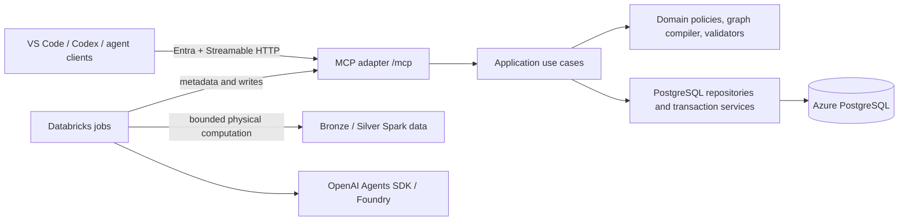

# GDS ETL Workbench Release 1 — One-shot `/goal` implementation plan

**Prepared:** 2026-08-04  
**Plan status:** Ready; submitting the Section 1 goal unchanged approves the three exact Section 7 contracts  
**Release boundary:** PostgreSQL + MCP server + Databricks jobs/workflows

## 0. Architecture simplification amendment — approved 2026-08-05

This amendment is part of the execution contract and supersedes contrary
wheel, thin-notebook, generated runtime-registry, layered test-location, and
MCP module-layout requirements later in this document. At its approval time it
did not change the approved DD-108, DD-109, or DD-110 contracts, the then-current
exact 25-tool public MCP baseline, database behavior, authorization, grant
binding, lock protection, revision fencing, idempotency, redaction, or
external-safety gates. The later approved Section 0.1 expressly supersedes only
that MCP baseline with its exact 23-tool actor-separated surface and fixed
non-MCP human workflow control.

The approved implementation target is:

1. Keep six separate Databricks notebooks. Each notebook imports first-party
   source from one fixed, versioned workspace parent path and owns its model,
   reasoning, system prompt, instruction prompt, prompt parameters, tool
   requests, and workflow settings.
2. Do not build or install a first-party jobs wheel. Compile the complete
   notebook definition once at startup with strict prompt parameter handling.
   Cluster configuration still supplies third-party dependencies.
3. Replace wheel, package-inventory, entry-point, profile-registry,
   workflow-configuration-registry, and phase-registry identity machinery with
   a fixed configured Databricks workspace/job identity plus safe release and
   notebook-definition audit values. Versioned workspace folders are writable
   only by the deployment identity and readable by the job identity.
4. Keep MCP as one Azure App Service monolith and one PostgreSQL database. Use
   feature-first domain modules with small interfaces. Do not add microservices,
   internal HTTP, a command bus, or an event bus.
5. Validate raw data once at each trust seam and preserve its typed form.
   Recheck changing authorization, grant, expiry, lock, revision, digest,
   compare-and-swap, graph, and idempotency facts inside the transaction.
6. Put all tests, test support, fake identities, and recorded outputs under one
   root `tests/` project. App Service and Databricks publication use source
   allowlists and never copy test code.

The implementation must remove superseded code and repeated tests after its
replacement tests pass. The decision rationale is recorded in
`docs/adr/0001-source-loaded-databricks-and-modular-app-service.md`.

## 0.1 Principal-separated MCP and workflow control amendment — approved 2026-08-06

This amendment is part of the execution contract and supersedes contrary
exact-25-tool, actor-neutral discovery, human workflow-over-MCP, one-HTTP-route,
and no-REST-surface requirements later in this document. It leaves DD-108,
DD-109, and DD-110 exactly unchanged. It also leaves the single App Service
process, one MCP endpoint, one PostgreSQL pool, verified mutation-promotion
gate, server-derived identity, Tenant and Model ownership, Workflow Grant
binding, revision fencing, idempotency, redaction, database integrity, and
external-safety requirements unchanged.

The approved implementation target is:

1. Treat the server-derived principal kind, never MCP client metadata, as the
   tool-audience boundary. Every MCP tool is classified exactly as human-only,
   workload-only, or shared.
2. Remove `authorize_workflow_run` and `revoke_workflow_run` from MCP. The exact
   MCP registry contains 23 tools: five human-only catalog/navigation tools,
   eight shared Model/change-set tools, and ten workload-only workflow,
   Profiling, and Mapping-materialization tools. A human sees 13 tools and the
   exact configured workload sees 18, further reduced globally when verified
   mutation promotion is absent.
3. Apply the same audience allowlist to MCP discovery and direct calls. A tool
   outside the current principal's inventory is rejected before request-schema
   parsing with the same safe response as an unknown tool. Tool annotations,
   cached client inventory, names, handles, and request fields grant no access.
4. Serve principal-filtered MCP capability and registry resources and allow
   only schemas belonging to that principal's enabled MCP tools. No prompt,
   generic dispatcher, alias, or alternate MCP registration may bypass the
   audience boundary. Human-readable Model Snapshot archives must not embed
   the MCP registry, capabilities, schema catalog, or MCP request/result
   schemas; snapshot contract files use an explicit transport-neutral allowlist.
5. Keep the exact configured `Workflow.Run` workload on `/mcp`. Workload tools
   still require the existing exact identity, active unexpired grant, initiating
   human, Model, workflow, immutable selection, allowed operation, binding, and
   transport-handle checks on every call.
6. Add only three fixed, typed, bounded, Easy-Auth-protected non-MCP human
   workflow-control operations: authorize, revoke, and safe status. Authorize
   and revoke require verified mutation promotion. Status returns the bounded
   authoritative Workflow Run summary and safe diagnostics, never the workload
   contract, raw profile rows, prompts, secrets, arbitrary SQL, generic CRUD,
   upload, code execution, or foundational mutation.
   The exact routes are JSON-only `POST /workflow-control/v1/authorize`,
   `POST /workflow-control/v1/revoke`, and
   `POST /workflow-control/v1/status`, each bounded by the standard request and
   result limits and returning the common safe error envelope. Authorize and
   revoke reuse their strict v1 request/result contracts. Status requires the
   exact run/grant UUID pair and returns only scalar run/grant state, workflow,
   Model ID, aggregate item counts, timestamps, binding-presence booleans, and
   a bounded diagnostic count. It is available only to the initiating human
   with current Workflow authorization or an owning-Tenant Tenant Admin/super admin;
   private ownership and identifier failures are normalized to not-found.
7. Keep manual Databricks launch unchanged: the human control authorization
   returns the existing safe run/grant handles, and the predefined workload
   activates and loads its immutable contract through MCP. This amendment does
   not authorize Databricks launch/cancel calls, a portal deployment, another
   service, internal HTTP, a command bus, or an event bus.
8. Prove exact human/workload inventories, guessed-call rejection, resource and
   schema filtering, cross-session cache isolation, control-route authorization
   and promotion gating, safe status, retained workload execution, artifact
   parity, and immutable reference-snapshot integrity with rejecting tests.

The decision rationale is recorded in
`docs/adr/0002-principal-separated-mcp-and-workflow-control.md`.

## 0.2 Notebook-selected agent runtimes amendment — approved 2026-08-06

This amendment is part of the execution contract and adds a bounded runtime
choice to the notebook-owned definition established by Section 0. It leaves
DD-108, DD-109, DD-110, the exact principal-separated MCP surface, database
behavior, authorization, grant binding, lock protection, revision fencing,
idempotency, redaction, and every external-safety gate unchanged. The user's
explicit request for LangChain `create_agent`, LangChain Deep Agents, and the
OpenAI Agents SDK supplies the product direction required by the new-dependency
decision gate later in this document.

The approved implementation target is:

1. Give each of the five modeling Notebook Definitions one required,
   notebook-wide, strictly allowlisted agent runtime:
   `openai_agents_sdk`, `langchain_create_agent`, or
   `langchain_deep_agent`. Profiling remains deterministic and must not select
   an agent runtime. Arbitrary modules, import paths, providers, backends, or
   runtime mixing between phases are forbidden.
2. Keep the normalized phase settings notebook-owned: Foundry deployment name,
   optional reasoning effort, optional verbosity, maximum turns, bounded outer
   retries, prompts, prompt parameters, requested MCP capabilities, and
   context/package limits. Omit optional model settings from provider requests
   when the notebook leaves them unset; never silently reinterpret an
   unsupported setting.
3. Preserve one code-owned safety envelope across all three runtimes. It owns
   the phase deadline, one workflow-wide concurrency semaphore, aggregate model
   call and generated-token budgets, typed structured output, exact MCP tool
   allowlists, output-size enforcement, retry classification/backoff,
   cancellation, safe telemetry, redaction, and disabled tracing. Framework,
   model-client, and MCP-client retries remain zero so the bounded outer retry
   loop is the only retry owner.
4. Use Microsoft Foundry's OpenAI-compatible v1 Chat Completions endpoint with
   the configured deployment name as `model`, managed/workload identity bearer
   tokens, HTTPS-only credential-free configuration, bounded non-redirecting
   transports, and no API key. Reasoning, verbosity, tool calling, and typed
   output still require support from the selected Foundry deployment; live
   deployment proof remains the separately authorized T25 gate.
5. Use LangChain `ToolStrategy` for typed structured responses and expose only
   the phase's code-owned MCP tools. Deep Agents uses only an ephemeral state
   backend; its filesystem, shell/execute, persistent memory, skills, sandbox,
   and default subagent surfaces are unavailable. LangSmith and OpenAI tracing
   remain disabled regardless of ambient tracing environment variables.
6. Pin every added runtime dependency exactly, export the complete hash-bearing
   locked production closure as the Databricks install input, reject ambient Deep
   Agents profile plugins, publish a new immutable jobs source release and
   changed Notebook Definition versions, prove source reproducibility and
   importability, and rerun the affected T17/T24 gates. T24 remains incomplete
   until its consent-gated audits and clean aggregate pass; T25 remains external
   until explicitly authorized and evidenced.

The decision rationale is recorded in
`docs/adr/0003-notebook-selected-agent-runtimes.md`.

## 0.3 Governed DBML export amendment — approved 2026-08-06

The requested DBML visualization capability is additive and supersedes the
Release 1 exact-tool and exact-workflow counts only as stated here. Add one
shared read-only `get_model_dbml` MCP tool that generates a deterministic,
revision-bound ZIP resource from effective applied Conceptual and Logical
Sections. Its strict request contains `model_id`, optional expected Model
revision, `layer=conceptual|logical|both`,
`logical_mode=complete|bundle`, and `colorize`; it contains no filesystem path.
The typed result contains a bounded manifest and immutable resource link. A
human MCP client downloads the resource and chooses its own current or selected
directory.

Add a seventh deterministic `dbml` Workflow Run and notebook. Its frozen request
contains the same render options plus one normalized relative output directory.
The jobs deployment owns a configured Unity Catalog Volume root. Publication is
restricted beneath that root, uses a Model-revision/export-digest directory,
rejects absolute paths, traversal, control characters, symlinks, unsafe archive
members, and different existing bytes, and accepts byte-identical retries. The
workflow calls the same MCP tool/resource and completes through one dedicated,
idempotent `complete_dbml_export` workload tool after output publication.

The registry is now exactly 22 tools: five human-only, nine shared, and eight
workload-only. Human discovery contains 14; configured-workload discovery
contains 17 when mutation registration is promoted. There are seven deployment
definitions and notebooks. Only effective `active|needs_review` artifacts are
exported; invalid effective endpoints fail closed. File count, individual DBML
bytes, aggregate DBML bytes, archive bytes, and manifest bytes are code-bounded.
DBML output remains reconstructible convenience output and never changes Model
state or revision.

This amendment preserves the prohibition on App Service writes to client-local
paths and arbitrary caller-selected filesystem roots. It supersedes only the
exact 23-tool/six-workflow counts and the prior deferral of DBML without an
explicit contract. ADR-0004 records the decision.

This document is the durable execution contract for a long-running Codex goal. It
captures the current repository, the accepted Feature 001 architecture, the
dependency-aware task map, workflow behavior, safety boundaries, and measurable
completion gates. It deliberately does not resume or modify the live Guided
Development state in the reference workspace.

---

## 1. Copy-paste goal

Start Codex in the development workspace and submit the following:

```text
/goal Build GDS ETL Workbench Release 1 end to end in
/Users/maazuddinmohammed/main/projects/gds_etl_workbench_test_development by
following IMPLEMENTATION_PLAN.md as the authoritative execution contract.

Outcome: deliver the canonical fresh PostgreSQL schema, a stateless
Entra-authenticated Python MCP server at /mcp with live/ready health endpoints,
and the separate tested Databricks jobs package implementing Profiling,
Analysis, Conceptual, Logical, Dimensional, and Mapping workflows.

Constraints: write only inside the development workspace; treat
/Users/maazuddinmohammed/main/projects/gds_etl_workbench as strictly read-only;
never copy changes back; never load a user or external database DSN in local/CI
tests (T25 alone may use its separately approved sentinel-guarded fixture);
never expose secrets, Scope mutation, lock toggles, Tenant Lease tools,
foundational mutation, generic SQL, or delete tools through MCP; do not deploy,
push, open a PR, or write to Azure/Databricks without explicit approval. You
may initialize Git, add files, and create local commits only in the development
workspace. Resolve and record DD-108, DD-109, and DD-110 before their dependent
tasks. Preserve all
accepted non-superseded Feature 001 decisions.

Decision authority: by submitting this goal unchanged, I explicitly approve
the exact v1 contracts in Section 7 for DD-108, DD-109, and DD-110. Record
those decisions and continue without pausing. If I do not accept a default, I
will edit this paragraph before submission to state the replacement decision.

Local checkpoint authority: submission also approves the bounded local plans
and rejecting-test gates for P00/T26 through T24 in Section 13, including local
Git commits and fixture-owned disposable PostgreSQL. It does not authorize T25,
any cloud write, any populated/external database, push, PR, or destructive
cleanup; those still require their explicit gate.

Work through the dependency gates in this plan, maintain IMPLEMENTATION_STATUS.md
after every work package, use tests before or with each behavior, and continue
until every local completion criterion passes. External Azure/Databricks gates
must be run only when the user supplies the dedicated test environment and
explicitly authorizes them; otherwise complete all independent local work,
finish with a precise external-gate handoff, mark environment release EXTERNAL,
and do not claim it complete.

Done means all planned source, contracts, DDL, tools, workflows, documentation,
deployment artifacts, and invariant tests exist; formatting, lint, type,
unit, contract, disposable-PostgreSQL, authorization, concurrency, deterministic
workflow, local Spark, MCP end-to-end, and extracted-ZIP boot gates pass; the
frozen reference snapshot remains hash-identical; start/end reference state and
any independently produced drift are reported without being “repaired”; and
the final report lists evidence, remaining external-only gates, and no hidden
skips.
```

Why this shape: Codex Goal mode uses the goal text as both the initial prompt
and the completion criteria. A good goal therefore names the outcome,
constraints, and verification explicitly. See the current
[Codex long-running work guide](https://learn.chatgpt.com/docs/long-running-work).

---

## 2. Source authority and frozen planning baseline

When sources disagree, use this precedence:

1. The isolation and safety rules in this plan.
2. Accepted, non-superseded decisions and detailed prose in
   `docs/features/FEATURE-001.md` from the reference workspace.
3. The current task dependency graph in `tasks/index.json` and the individual
   `tasks/TASK-*.json` records.
4. Current-state facts in `docs/codebase.md` and the actual DDL/source.
5. `docs/gds-etl-workbench-agent-handoff.md` and `sample_code/` as historical
   evidence only.

The plan was derived from this reference snapshot:

| Item | Inspected value |
|---|---|
| Reference Git HEAD | `1320c3e15a053e975f6cbb7ecb7031253bc286c0` |
| Feature 001 SHA-256 | `04b7dcd0b0c75a9815e4f4c8f1695f5fae10168c67e317398bb2564982383d5b` |
| 52-file DDL/sample/handoff aggregate | `cd2ae4312e22ef9628f5af31ce571063dd0f7fe2148877f456d091cc0c3efbd9` |
| Task-ledger aggregate | `1ea9fe996fb17527d5ef022dfc0d9a712f9884f7dcb1fa0d5454386bfd14dcef` |
| Reference state at inspection | Dirty; TASK-026 active; baseline staged but uncommitted |

The live task state can legitimately change after this plan is created. A goal
must record the reference state at its own start, must not normalize or repair
it, and must not silently rebase this plan onto changed requirements. If the
Feature 001 hash differs, stop and ask whether to re-plan or execute this frozen
contract. A task-state-only change does not invalidate this plan.

Known document traps:

- Feature 001 is canonical over the older handoff.
- Release 1 has six workflow families, not the handoff's older five.
- Routine writes use short Model-row coordination, not Tenant Leases or public
  lease tools.
- Entra linkage already exists in the current DDL.
- The Dimensional heading still says “under review,” but later accepted
  decisions and acceptance criteria approve it.
- Five decisions are superseded and four are partially superseded; later
  accepted decisions win.
- Root `README.md` describes Guided Development, not the product.

---

## 3. Non-negotiable workspace isolation

Before any implementation:

1. Resolve `pwd -P` and require exact equality with the development workspace.
2. Resolve the reference path separately and require it to be different.
3. Capture `git status --porcelain=v2 --branch` in the reference workspace as a
   read-only start artifact under the development workspace.
4. Never run `apply_patch`, formatting, dependency installation, Git mutation,
   test setup, generated-code output, or database scripts with the reference
   workspace as the working directory.
5. Never use `git reset`, `git clean`, `git checkout`, `git commit`, `git add`,
   or `git stash` against the reference workspace.
6. Never synchronize with `--delete` and never copy development output back to
   the reference workspace.
7. At completion, capture reference status again and compare it byte-for-byte
   with the start artifact. If it changed, report the difference as concurrent
   external drift and compare the immutable local manifest; do not attempt to
   restore it and do not fail otherwise-complete local work merely because
   another process legitimately advanced the live reference.

Create a local, immutable reference snapshot only after validating the expected
Feature 001 and baseline digests. Copy an explicit allowlist into
`reference_snapshot/`:

- `database/*.sql`
- `sample_code/gds_ai/**/*.py` and `sample_code/gds_ai/dbml.txt`
- `sample_code/notebooks/*.py`
- `docs/codebase.md`
- `docs/features/FEATURE-001.md`
- `docs/gds-etl-workbench-agent-handoff.md`
- `tasks/index.json` and `tasks/TASK-*.json`

Exclude `.git`, `.env*`, `.DS_Store`, caches, bytecode, live `.guided-dev`
state, repository hooks/rules, and credentials. Generate
`reference_snapshot/MANIFEST.sha256`, make the snapshot non-writable, and add an
import-boundary test proving production packages never import it.

After the manifest is verified, copy the nine explicit `database/1_*.sql`
through `database/9_*.sql` files a second time into the target's writable
`database/` product tree. Record their original hashes, then evolve these target
copies into the fresh canonical schema. Never run them from or write them back
to the reference workspace.

Initialize a clean Git repository in the development workspace if needed.
The Section 1 goal grants authority to initialize, add, and create local
checkpoint commits only in the target. Never push or open a pull request without
separate approval.

---

## 4. Current project understanding

### 4.1 Mission

GDS ETL Workbench is an Azure-native, AI-assisted data-modeling platform.
PostgreSQL is the shared system of record. Interactive agent clients use MCP;
Databricks jobs use Microsoft Foundry models through the OpenAI Agents SDK and
use MCP for every PostgreSQL metadata operation; Spark reads physical
Bronze/Silver data directly. A general FastAPI/React management application is
future scope.

### 4.2 Current implementation state

The reference repository contains:

- nine PostgreSQL DDL files;
- four prototype workflows: Profiling, Analysis, Conceptual, and Logical;
- four thin but hard-coded Databricks notebook entry points;
- a strong prototype kernel of Pydantic contracts, registries, compilers,
  deterministic validators, scoped SQL, lock-aware diffs, and atomic MERGEs;
- a 4,000-line accepted feature design and 26-task ledger.

It does not contain:

- an MCP server or protocol tests;
- a package/dependency lock for production code;
- a canonical schema compatible with the accepted design;
- Dimensional or Mapping workflow implementation;
- Entra request middleware or enforced authorization;
- model revision/source-digest concurrency fencing;
- durable change-set and Profiling Run state;
- production deployment code;
- any automated test suite.

Task state at inspection:

| State | Count | Meaning |
|---|---:|---|
| Completed | 0 | No implementation task is complete |
| In progress | 1 | TASK-026 is in its teaching gate |
| Dependency-blocked | 19 | Await prerequisite tasks |
| Backlog/design-blocked | 6 | Await DD-108, DD-109, or DD-110 |

Do not resume TASK-026 in the reference repository. Reproduce its safe baseline
adoption as isolated bootstrap work in the new repository.

### 4.3 Domain vocabulary

- **Project** owns one or more Tenants.
- **Tenant** owns Connections and exactly one owning relationship to each Model.
- **System** describes a business/technical source.
- **Connection** joins a Tenant to a System and owns physical Objects.
- **Object** is a physical source, Bronze, Silver, or Gold object.
- **Attribute** is a stable physical child of an Object.
- **Ingestion Mapping** records source-to-Bronze Object and Attribute lineage.
- **Model Scope** is the complete Bronze input context readable by a Model.
- **Selected Scope** is the explicit selection for one run.
- **Impact Scope** adds all dependents needed for consistency.
- **Modeling Assertion** is Model-owned document metadata plus structured
  Assertion Records; Records may persist as typed artifact support.
- **Analysis Relationship** is a candidate Attribute-level Bronze association.
- **Conceptual Object/Relationship** captures stable business concepts.
- **Logical Model** is the implementation-oriented Silver design.
- **Dimensional Model** is the Gold fact/dimension/bridge design.
- **Mapping** binds modeled artifacts to registered physical targets and stores
  transformation/generator documents.

Bronze Object ID is canonical for the Bronze-backed modeling layers. Original
source Objects remain provenance through ingestion lineage. A Model has one
owning Tenant, while its deliberately open source catalog and Model Scope may
contain Objects owned by other Tenants.

### 4.4 Intended runtime



MCP is a thin typed adapter. Authorization, redaction, readiness, validation,
canonicalization, revisions, locks, transactions, and persistence belong to
transport-neutral application/domain code. The OpenAI Agents SDK is appropriate
for the bounded phase workflows and provides typed agent runs and tracing.
Manager-style specialists should use `agent.as_tool()` so the workflow
orchestrator retains final ownership; see the current
[Agents SDK orchestration guide](https://developers.openai.com/api/docs/guides/agents/orchestration#use-agents-as-tools-for-manager-style-workflows).

---

## 5. Release 1 scope

### Included

- Canonical fresh PostgreSQL schema, constraints, indexes, triggers, functions,
  and least-privilege runtime roles.
- Stateless Python MCP server named `mcp_server/`.
- Streamable HTTP endpoint `/mcp`.
- `/health/live` and `/health/ready`.
- Entra/App Service identity resolution, server-derived ownership, authorization,
  grant delegation, and redaction.
- Bounded discovery, Model/readiness, Assertion, snapshot, profiling, and Model
  Change Set surfaces.
- Eight-document Model Change Sets: Model Scope, Profiling, Assertion, Analysis,
  Conceptual, Logical, Dimensional, and Mapping.
- Separate `jobs/` package and thin notebooks for all six workflow families.
- A secret-free Azure Linux App Service ZIP.
- Deterministic local, PostgreSQL, Spark, MCP, concurrency, artifact, and
  end-to-end test gates.
- Guarded external Azure and user-run Databricks release smoke procedures.

### Explicitly deferred

- General REST/FastAPI management backend and React UI.
- Foundational metadata/Connection CRUD surfaces.
- Human Model Scope mutation surface.
- Human business lock/unlock surface.
- Public Tenant Lease tools.
- Physical Silver/Gold DDL generation/deployment and automatic registration.
- Generated ETL-code execution, deployment, scheduling, or orchestration
  process metadata.
- Hard delete, Model Scope removal cleanup, in-place migrations, backfills,
  ADLS archival, and payload deletion.
- Server-side file upload, OCR, document parsing, or RAG.

The first release consumes foundational metadata, Model Scope, identities, roles,
targets, and Mapping headers supplied by the user's existing external
Excel-to-PostgreSQL process.

---

## 6. Canonical invariants

These are release-blocking, not aspirational:

1. PostgreSQL is authoritative for applied state, drafts, grants, Profiling
   Runs, receipts, and events.
2. Every Model-owned row has `model_id`.
3. Every Model-owned parent/child foreign key includes `model_id`.
4. Object/Attribute pairs are enforced relationally.
5. Stable server-generated IDs are persisted; names are never relational
   mutation identity.
6. Applied lifecycle is exactly `active`, `needs_review`, `inactive`, and
   `deprecated`.
7. Candidate state exists only in unapplied in-memory/change-set content.
8. Omission means unchanged; no workflow infers retirement from omission.
9. Physical deletion is outside automated workflows.
10. Locked curated rows and protected descendants are immutable through every
    write path.
11. Validation reports all safely discoverable issues and performs no effective
    Model write.
12. Apply revalidates the exact candidate and commits all sections or none.
13. One effective transaction increments `model_revision` exactly once; no-op,
    draft, read, put, and validation operations do not.
14. Same-Model commits serialize on the Model row; different Models may commit
    concurrently.
15. Routine modeling never uses the long-lived Tenant Lease.
16. Source-context changes are detected by a deterministic digest, not by
    trusting stale snapshots.
17. Tenant/Model ownership and actor identity are derived server-side.
18. Active authenticated Principals may read global Tenants; private Tenant
    reads require Tenant access or super admin. Visibility never grants writes.
19. Only owning-Tenant Architects/Tenant Admins or super admins can apply or
    lock Model artifacts; Developers may prepare drafts and permitted workflows.
20. Workflows use short-lived grants bound to the initiating human, Model, run,
    selection, operations, and expiry.
21. Databricks never connects directly to the metadata PostgreSQL database.
22. Raw physical datasets do not traverse MCP.
23. Connection values, secret contents/references, tokens, access rows, raw
    prompts, raw tool output, and raw run dumps never appear in ordinary MCP
    results or logs.
24. Mutating tools remain disabled/unregistered until their complete local gate
    passes.
25. MCP inventory and contract metadata are filtered by server-derived actor
    kind: humans cannot discover or invoke workload-only workflow, Profiling,
    or Mapping-materialization tools, and human workflow authorization,
    revocation, and bounded status use only the fixed non-MCP control routes.

---

## 7. One-shot decisions for the three open design gates

Feature 001 deliberately leaves DD-108, DD-109, and DD-110 open and forbids
dependent implementation from guessing. This section freezes complete v1
defaults. Submitting the Section 1 goal unchanged explicitly approves these
exact contracts; copy them verbatim to
`docs/design/RELEASE-1-DECISIONS.md`. An edited replacement in the submitted
goal has higher authority. Without either approval, finish independent work and
stop before T03/T05/T18/T21/T22/T23.

### 7.1 DD-108 — exact Profiling development/test batch contract

Add these four nullable columns directly to the writable target copy of
`core.connection`:

```sql
profiling_development_initial_batch_id BIGINT,
profiling_development_incremental_batch_ids BIGINT[],
profiling_test_initial_batch_id BIGINT,
profiling_test_incremental_batch_ids BIGINT[],
```

Arrays use PostgreSQL `BIGINT[]`, preserve arbitrary signed `BIGINT` source
keys, and when non-null must be one-dimensional, lower-bound 1, sorted
ascending, duplicate-free, contain no null, and contain at most 1,000 values.
Each non-null initial ID must not occur in its environment's incremental array.
An immutable, schema-qualified
`core.is_canonical_batch_id_array(BIGINT[])` helper plus exact per-environment
CHECK constraints enforces this. `NULL` and an explicit empty array are
intentionally distinct.
The external Excel/bootstrap loader must emit blank/SQL NULL for unconfigured
values and canonical PostgreSQL array values such as `{}` or `{-2,7,9}`; JSON
or comma-delimited strings are rejected.

The strict request extension is:

```text
batch_environment: Literal["development", "test"]
batch_mode: Literal["initial", "incremental"]
```

Both fields are required for Profiling and are forbidden on Analysis. For each
selected Object, common code applies these exact rules:

1. If `batch_attribute_name IS NULL`, ignore all four Connection fields and
   perform the ordinary bounded unfiltered read.
   T03 constrains the stored value to null or nonblank.
2. Otherwise resolve that exact case-sensitive name to one active Attribute of the
   same Object. A missing, ambiguous, or inactive Attribute blocks readiness.
3. `initial` selects the one environment-specific initial ID and generates an
   equality predicate. A null ID is unconfigured and blocks that Object.
4. `incremental` selects the environment-specific array and generates a
   membership predicate over every configured value. A null array is
   unconfigured and blocks; `{}` is a configured deterministic no-op for that
   Object and never falls back to a full scan.
5. There is no development↔test, initial↔incremental, or missing↔unfiltered
   fallback for an Object that declares a batch Attribute.
6. Mixed-Connection selection resolves the applicable field independently for
   each Object's own Connection; one Connection's IDs never filter another.
7. Readiness requires the batch Attribute metadata type to be Spark
   byte/short/integer/long or `DECIMAL(p,0)`, and proves every configured ID fits
   that exact type. Spark builds predicates with column/literal APIs and casts
   only the already range-checked literal to the declared physical type; it
   never casts the data column or interpolates SQL. String, floating, scaled
   decimal, unknown, or incompatible types block before Spark, so filtering
   cannot silently discard an uncastable value.
8. Empty incremental configuration contributes no success/failure rows. If all
   selected batched Objects are explicit no-ops and no unbatched Object remains,
   finalization records a successful no-op and advances no Model revision.

Readiness reports every affected Connection/Object and correction in one pass.
The Profiling Run records the selected environment/mode and resolved per-Object
batch values in immutable request context; Attribute Profile identity remains
`(model_id, attribute_id)` rather than adding batch history.

### 7.2 DD-109 — exact combined Mapping persistence

Use exactly three tables. Add no environment, contributor, materialization,
Relationship-mapping, or orchestration-process table/column.

Every table uses the common Feature 001 envelope: generated `BIGINT` ID,
`model_id BIGINT`, nullable `agent_run_id VARCHAR(500)`, prefixed lifecycle
`VARCHAR(20)` default `active`, prefixed lock Boolean default false,
`created_time/updated_time TIMESTAMPTZ` default current timestamp, and
`created_by/updated_by VARCHAR(255)` default current user. Lifecycle is exactly
`active|needs_review|inactive|deprecated`; all FKs use `ON DELETE NO ACTION`.

#### `workflow.mapping_source_system_dependency`

One row controls each `(model_id, modeled_entity_type, source_system_id)`
execution wave. It carries the common envelope plus
`source_system_dependency_order INTEGER NOT NULL DEFAULT 0`. Equal orders may
run in parallel; lower orders complete before higher orders.

#### `workflow.object_mapping`

| Column | Type/null/default |
|---|---|
| `object_mapping_id` | `BIGINT GENERATED ALWAYS AS IDENTITY PRIMARY KEY` |
| `model_id` | `BIGINT NOT NULL` |
| `agent_run_id` | `VARCHAR(500) NULL` |
| `modeled_entity_type` | `VARCHAR(30) NOT NULL`, `logical_entity|dimensional_entity` |
| `logical_entity_id` | `BIGINT NULL` |
| `dimensional_entity_id` | `BIGINT NULL` |
| `target_object_id` | `BIGINT NOT NULL` |
| `source_system_id` | `BIGINT NOT NULL` |
| `object_dependency_order` | `INTEGER NOT NULL DEFAULT 0`, non-negative |
| `artifact_type` | `VARCHAR(30) NULL`, `sql_file|python_file|python_notebook` |
| `artifact_generation_instructions` | `TEXT NULL`, nonblank and at most 32,768 characters when present |
| `mapping_profile_key` | `VARCHAR(100) NULL`, pattern `[a-z][a-z0-9_.-]{0,99}` |
| `mapping_profile_version` | `VARCHAR(50) NULL`, SemVer `major.minor.patch` |
| `mapping_profile_schema_digest` | `CHAR(64) NULL`, lowercase SHA-256 |
| `mapping_package_document` | `JSONB NULL`, object root |
| `mapping_package_digest` | `CHAR(64) NULL`, lowercase SHA-256 |
| `object_mapping_transformation_document` | `JSONB NULL`, object root |
| `object_mapping_status` | common lifecycle |
| `object_mapping_is_locked` | common lock |
| common audit fields | exact common envelope above |

Exactly one typed Entity ID must be non-null and agree with
`modeled_entity_type`. Composite FKs bind that Entity to the same Model;
an FK binds the exact Mapping Source System Dependency row, and an ordinary FK
binds the target Object. Add unique witness
`(object_mapping_id, model_id, modeled_entity_type, target_object_id)`. Preserve
binding identity across every lifecycle state with two partial unique indexes:

```text
(model_id, logical_entity_id, target_object_id, source_system_id)
  WHERE modeled_entity_type = 'logical_entity'
(model_id, dimensional_entity_id, target_object_id, source_system_id)
  WHERE modeled_entity_type = 'dimensional_entity'
```

A pre-registered binding has all eight authored fields null: artifact type,
instructions, profile key/version/schema digest, package document/digest, and
Object transformation. An authored header has all eight non-null. Null
transformation therefore means “binding exists but is not script-ready”; a
completed no-expression header explicitly stores `transformation_kind=direct`.

#### `workflow.attribute_mapping`

| Column | Type/null/default |
|---|---|
| `attribute_mapping_id` | `BIGINT GENERATED ALWAYS AS IDENTITY PRIMARY KEY` |
| `model_id` | `BIGINT NOT NULL` |
| `agent_run_id` | `VARCHAR(500) NULL` |
| `object_mapping_id` | `BIGINT NOT NULL` |
| `modeled_entity_type` | `VARCHAR(30) NOT NULL`, same discriminator as parent |
| `target_object_id` | `BIGINT NOT NULL`, repeated parent witness |
| `logical_attribute_id` | `BIGINT NULL` |
| `dimensional_attribute_id` | `BIGINT NULL` |
| `target_attribute_id` | `BIGINT NOT NULL` |
| `attribute_mapping_transformation_document` | `JSONB NULL`, object root |
| `attribute_mapping_status` | common lifecycle |
| `attribute_mapping_is_locked` | common lock |
| common audit fields | exact common envelope above |

Exactly one typed modeled Attribute is non-null and agrees with the parent's
layer. A composite FK to the Object Mapping witness carries Model/layer/target
Object; a `(target_attribute_id, target_object_id)` FK uses a required
`core.attribute(attribute_id, object_id)` unique witness. Two partial unique
indexes preserve `(model_id, object_mapping_id, typed_attribute_id,
target_attribute_id)` identity across lifecycle. A target Attribute may have
multiple contributor bindings, but an existing binding can never be repointed.
Null transformation is an unauthored registered binding; completed direct
content explicitly stores `transformation_kind=direct`.

A transaction-deduplicated deferred graph validator enforces all cases
ordinary FKs cannot express:

- the typed modeled Attribute belongs to the exact typed Entity on its header;
- effective child, typed parents, and target parent are effective/valid;
- Logical headers target registered Silver and Dimensional headers registered
  Gold, using externally bootstrapped normalized `zone_code` values
  `bronze|silver|gold`;
- every effective header in one
  `(model_id, modeled_entity_type, target_object_id, source_system_id)` package
  has byte-equivalent artifact/profile/instruction fields and equal
  canonical package JSON as well as equal digest;
- one source System/layer has one controlled dependency row;
- one target Object/layer has one `object_dependency_order`;
- parent/child binding identity columns are immutable after insert;
- locked rows and locked-header descendants are immutable, and ordinary DML
  cannot toggle lock flags.

To make that route check declarative, T03 adds
`reference.zone.zone_code VARCHAR(30) NOT NULL`, with case-insensitive
uniqueness. Release fixtures/bootstrap use the exact codes `bronze`,
`silver`, and `gold`; display names remain independent.

The supporting indexes cover Model/package/status, source-System and Object
wave orders, each typed Entity/Attribute, target Object/Attribute, source
System, parent traversal, and partial locked-row lookup. Catalog tests assert
the exact indexes rather than treating this list as query-planner advice.

### 7.3 DD-109 — exact Mapping JSON/Pydantic profile

Freeze one allowlisted profile:

```text
key: mapping.standard
version: 1.0.0
classes: HeaderMapperOutputV1, AttributeMapperBatchOutputV1,
         GeneratorDocumentV1
```

Every model has an object root, `extra="forbid"`, required nullable fields
instead of omitted ambiguity, no arbitrary dictionaries, JSON-mode
serialization, and strict Structured Outputs preflight. Stable database IDs are
allowed in the two agent-stage contracts; `GeneratorDocumentV1` contains names
and provenance but no database IDs.

The schema digest is SHA-256 of the T02 canonical JSON bundle containing the
three generated JSON Schemas in class-name order. Registry key+SemVer+digest
must resolve exactly before a run. A registered version is immutable and every
version referenced by an effective row remains deployed/readable. Build may
author a previously unauthored binding/package only with the selected profile
and must match any already-authored header in that package. Extend may upgrade a
complete unlocked target/System
package atomically to another allowlisted version; partial/mixed upgrade or an
unavailable stored version blocks. A locked row blocks a required upgrade.

`MappingPackageDocumentV1` has exactly:

- `schema_version: Literal["1.0"]`;
- unique stable `package_ref`,
  `route=logical_to_silver|dimensional_to_gold`, `target_object_id`,
  `source_system_id`, `artifact_type`, nonblank
  `artifact_generation_instructions`, and exact
  `pydantic_profile(key, version, schema_digest)`;
- `executable_sources[1..128]`: `object_id`, unique identifier `alias`, nonblank
  `role`, and nullable `batch_rule(attribute_id, values: list[BIGINT])`;
- `non_executable_provenance[0..128]`: items with
  `lineage_kind=original_ingestion|prior_mapping`, `source_system_id`,
  `source_object_id`, `ingestion_object_mapping_ids[0..16]`,
  `prior_object_mapping_ids[0..16]`, and nonempty unique
  `executable_source_aliases[1..16]`, never executable FQNs. Original ingestion
  requires at least one ingestion ID and zero prior-Mapping IDs; prior Mapping
  requires the inverse. Every ID/path must resolve in frozen lineage.
- `runtime_parameters[0..128]`: unique identifier `name`, nonblank `data_type` and
  `purpose`, and nullable string/integer/Boolean `default_value` (no float);
- `source_system_dependencies[0..256]`:
  `predecessor_source_system_id`, nonblank `reason`;
- `target_dependencies[0..256]`: `predecessor_target_object_id`, nonblank `reason`;
- `steps[1..256]`: unique identifier `name`, unique `depends_on`, unique `inputs`,
  unique output `output`, and nonblank free-text `logic`;
- nonblank `grain_and_deduplication`;
- `load`: `write_mode=append|overwrite|merge`, unique `merge_keys` target
  Attribute IDs, nullable nonblank `partition_basis`,
  `concurrent_system_write_mode=disjoint_partitions|idempotent_merge|serialized`,
  and nonblank `concurrent_write_basis`.

`ObjectMappingTransformationDocumentV1` has exactly:

- `schema_version: Literal["1.0"]`;
- `transformation_kind: direct|derived`;
- nonempty unique `source_aliases` drawn from the package;
- typed `joins[]` (`left_alias`, `right_alias`, `join_type`, nonblank
  `condition`), `unions[]` (`input_aliases`, `all`, nonblank `alignment`),
  `filters[]` (nonblank expressions), and `aggregations[]` (`output_name`,
  nonblank expression, unique grouping inputs);
- nonblank `entity_contribution_logic` and `rationale`.

`AttributeMappingTransformationDocumentV1` has exactly:

- `schema_version: Literal["1.0"]`;
- `transformation_kind: direct|expression`;
- `source_columns[]` of package `source_alias` plus `source_attribute_id`;
- nullable `step_output`, nullable `expression`, and nonblank `logic`.

`direct` requires exactly one source column and null expression. `expression`
requires a nonblank expression and may have zero sources for a constant/system
expression. A step output must exist in the named DAG. All aliases/Attributes
must resolve to executable lineage for the declared business System.

`HeaderMapperOutputV1` has `schema_version`, one exact `package`, a nonempty
`headers[]` of `(object_mapping_id, transformation)`, and `coverage` containing
unique nonempty expected and returned Object Mapping ID lists.

`AttributeMapperBatchOutputV1` has `schema_version`, `package_ref`, target and
source-System IDs, `chunk_index`/`chunk_count` in `1..100`, the 64-character
package digest, `coverage_manifest_digest`, `attribute_mappings[]`,
`target_attribute_dispositions[]`, and `coverage`. Each mapping contains parent
ID, exactly one existing
`attribute_mapping_id` or new `local_ref`, layer discriminator, exactly one
typed modeled Attribute ID, target Attribute ID,
`disposition=create|update|unchanged`, and complete transformation. Target
disposition is `mapped|already_mapped|intentionally_unmapped` with a reason
required only for intentionally unmapped. Coverage contains unique expected and
returned target Attribute IDs plus expected and returned existing child IDs.
Common code requires contiguous chunks, disjoint owned target/child IDs, one
final exact coverage manifest, and the same Header/package digest before
publishing the combined batch.

`GeneratorDocumentV1` is derived after commit. Its exact name-based nested
models are:

- `schema`: `document_version="1.0"`, profile key/version/schema digest;
- `applied_model`: nonblank Model name, positive revision, 64-hex source-context
  digest;
- `route: logical_to_silver|dimensional_to_gold`;
- `source_system`: nonblank code/name, non-negative dependency order, and
  `predecessors[0..64]` of nonblank code/name/reason;
- `artifact`: `type=sql_file|python_file|python_notebook` and nonblank
  generation instructions;
- `dependency_waves`: non-negative target order and
  `target_predecessors[0..128]` of target FQN/reason;
- `target`: catalog, schema, object name, FQN, `zone=silver|gold`, nullable
  nonblank description, nonblank grain/deduplication, and `columns[1..5000]`;
- each target column: name, data type, nullable Boolean, positive unique ordinal,
  and nullable nonblank definition;
- `executable_sources[1..128]`: unique alias, `zone=bronze|silver|gold`, catalog,
  schema, object name, FQN, `used_columns[1..10000]` of unique name, data type,
  nullable Boolean, and nullable nonblank definition/meaning, plus nullable
  `batch_rule(attribute_name, values[0..1000] BIGINT)`;
- `original_source_provenance[0..128]`: source System code/name, Connection code,
  source Object name, `lineage_kind`, `lineage_path[1..32]` human-readable named
  edges, and nonempty executable aliases; it contains no executable original-
  source FQN;
- `runtime_parameters[0..128]`: unique name, data type, purpose, and nullable
  string/integer/Boolean default;
- `named_steps[1..256]`: unique name, unique dependencies/inputs, unique output,
  and nonblank logic, all using names rather than IDs;
- `load`: write mode, merge-key target column names, nullable partition basis,
  concurrent-system-write mode/basis, and nonblank grain/deduplication;
- `entity_contributions[1..64]`: `layer=logical|dimensional`, Entity name,
  definition, unique source aliases, and the exact name-materialized
  `ObjectMappingTransformationDocumentV1` fields/cardinalities plus rationale;
- `target_columns[1..5000]`: target column name, disposition,
  `contributors[0..32]` of Entity/Attribute/source-alias/source-column names,
  `kind=direct|expression`, nullable step-output/expression, and nonblank logic/
  rationale. Disposition is `mapped|already_mapped|intentionally_unmapped`, with
  a nonblank reason required only for intentionally unmapped. Direct has exactly
  one contributor and no expression; expression requires an expression.

Every code/name/FQN/alias refers to the same committed package and is validated
against authoritative named metadata. Ordinary strings and lists use the limits
below, used source columns total at most 10,000 across all sources, FQNs are at
most 1,024 characters, ordinals are complete/unique, and the
target-column list covers every registered target column exactly once. No
database ID or secret field exists and no follow-up metadata lookup is required.

Contract limits are exact v1 values:

| Limit | Value |
|---|---:|
| entire `mapping.json` section | 16 MiB canonical UTF-8 |
| package / Object transform / Attribute transform JSON | 512 / 256 / 64 KiB |
| generator document | 4 MiB |
| packages per run | 1,000 |
| headers / sources / runtime parameters per package | 64 / 128 / 128 |
| dependencies / named steps per package | 256 / 256 |
| target Attributes per package | 5,000 |
| Attribute Mapper items per deterministic chunk | 500 |
| identifier / ordinary text / logic / instructions | 128 / 2,000 / 16,384 / 32,768 characters |

Oversize input blocks before model invocation and is never silently truncated.
The package digest is lowercase SHA-256 over contract-canonical JSON v1: strict
JSON-mode data only; UTF-8; object keys lexicographically sorted; array order as
contract-normalized; compact `,`/`:` separators; no insignificant whitespace,
NaN, Infinity, floats, or duplicate keys. Lists declared as sets are sorted by
their documented stable key before serialization. T02 supplies golden vectors
used by PostgreSQL/application/jobs tests.

### 7.4 DD-110 — exact Silver/Gold naming and policy storage

Use runtime-compatible `*_template` terminology and remove the current
`*_naming_rules` aliases. The fresh `model.model` has exactly:

```sql
silver_model_naming_template JSONB,
silver_model_audit_columns_template JSONB,
gold_model_naming_template JSONB,
gold_model_technical_columns_template JSONB,
gold_model_audit_columns_template JSONB,
```

The two Silver documents are either both null or both non-null. The three Gold
documents are either all null or all non-null. Null groups let external
foundational bootstrap create an incomplete Model; workflow readiness blocks
the affected layer. Every non-null value is an object with
`schema_version="1.0"`; Pydantic/JSON Schema performs the full shape check and
PostgreSQL CHECKs enforce group completeness, root type, version, and required
array keys.

`NamingTemplateV1`, used for both layers, has exactly:

```json
{
  "schema_version": "1.0",
  "default_style": "PascalCase",
  "submodel_style": "PascalCase",
  "entity_style": "PascalCase",
  "attribute_style": "PascalCase",
  "relationship_style": "PascalCase",
  "acronyms": {"id": "ID"},
  "max_length": 255,
  "reserved_words": []
}
```

V1 supports only `PascalCase`. Tokenization and rendering are the characterized
reference algorithm: replace non-ASCII-alphanumeric separators with spaces,
split acronym/camel/number words, lowercase lookup keys, apply configured
acronym spellings, capitalize other words, and concatenate. The result must
start with A–Z, contain only ASCII alphanumerics, fit `1..255`, and not equal a
reserved word case-insensitively. Acronym keys are unique canonical lowercase;
values and reserved words are nonblank; each collection has at most 256 items.
Unknown fields/styles fail readiness. Collision or overlength is an error—never
automatic suffixing or truncation.

`AuditColumnsTemplateV1`, used for Silver and Gold, is:

```text
schema_version: Literal["1.0"]
columns: list[1..32] of {
  semantic_name: nonblank string[1..255]
  data_type: nonblank string[1..100]
  nullable: boolean
  definition: nullable nonblank string[1..2000]
}
```

List order is final order after all business/technical Attributes. Derived
names must be unique after naming normalization. The document stores no role,
artifact ID, proposed/final name, or absolute ordinal. Logical projection sets
only `logical_attribute_is_audit_column=true`, creates no source mapping, and
matches existing audit rows by normalized name plus compatible type/nullability;
an ambiguous rename blocks.

`GoldTechnicalColumnsTemplateV1` is:

```text
schema_version: Literal["1.0"]
dimension_surrogate_key: {
  semantic_name_template: "{entity_name} key"
  data_type: string[1..100]
  nullable: false
  definition_template: string[1..2000]
}
fact_bridge_foreign_key: {
  with_role_semantic_name_template: "{role_name} key"
  without_role_semantic_name_template: "{entity_name} key"
  definition_template: string[1..2000]
}
type_2: {
  effective_from: PolicyColumnV1
  effective_to: PolicyColumnV1
  is_current: PolicyColumnV1
}
```

`PolicyColumnV1` is the audit-column shape without `schema_version`.
`effective_from` is non-nullable, `effective_to` nullable, and `is_current`
non-nullable. Only `{entity_name}` and `{role_name}` placeholders are accepted.
Fact/Bridge foreign-key data type is not independently configurable: it is
copied exactly from the referenced Dimension surrogate-key policy/Attribute;
its nullability is derived from final Relationship optionality. A mismatched
existing endpoint blocks readiness/projection rather than coercing a type.
The canonical fixture/bootstrap example uses `effective from time`
(`TIMESTAMPTZ`, non-null), `effective to time` (`TIMESTAMPTZ`, nullable), and
`is current` (`BOOLEAN`, non-null); production Models may supply different
values that validate against the same immutable shape.
The first Gold projection reuses/creates Entity-local surrogate, Type 2, and
audit Attributes; the second projects role-aware Fact/Bridge foreign keys after
Relationships settle. Agents never author or rename these policy rows.

Actual acronym/reserved-word lists, data types, names, and definitions are
external per-Model bootstrap data—not implementation guesses. Fixtures use the
examples above. A future incompatible shape/style is a new schema version,
never a silent v1 reinterpretation.

If the user edits any approved default, update every affected DDL, Pydantic/
JSON Schema, fixture, readiness rule, digest golden, task, and traceability row
before dependent code. Do not change unrelated accepted architecture.

---

## 8. Target repository and dependency boundaries

Use two independently locked Python projects so App Service never receives
Spark/Databricks dependencies:

```text
.
├── AGENTS.md
├── IMPLEMENTATION_PLAN.md
├── IMPLEMENTATION_STATUS.md
├── README.md
├── database/
│   ├── 01_reference.sql
│   ├── 02_core.sql
│   ├── 03_security.sql
│   ├── 04_model.sql
│   ├── 05_workflow_analysis.sql
│   ├── 06_workflow_conceptual.sql
│   ├── 07_workflow_logical.sql
│   ├── 08_workflow_dimensional.sql
│   ├── 09_workflow_mapping.sql
│   ├── 10_workflow_change.sql
│   ├── 11_workflow_profiling.sql
│   ├── 12_workflow_runtime.sql
│   └── 13_runtime_integrity.sql
├── docs/
│   ├── architecture/
│   ├── contracts/
│   ├── design/
│   ├── operations/
│   └── traceability/
├── mcp_server/
│   ├── pyproject.toml
│   ├── uv.lock
│   ├── app.py
│   ├── startup.sh
│   ├── src/gds_etl_workbench/
│   │   ├── domain/
│   │   ├── application/
│   │   ├── contracts/
│   │   │   └── schemas/v1/
│   │   ├── infrastructure/postgres/
│   │   └── adapters/
│   │       ├── mcp/
│   │       └── health/
│   ├── tests/
│   │   ├── unit/
│   │   ├── contract/
│   │   ├── postgres/
│   │   ├── authorization/
│   │   ├── concurrency/
│   │   └── e2e/
│   └── scripts/build_appservice_zip.py
├── jobs/
│   ├── pyproject.toml
│   ├── uv.lock
│   ├── src/gds_etl_jobs/
│   │   ├── runtime/
│   │   ├── profiling/
│   │   ├── analysis/
│   │   ├── conceptual/
│   │   ├── logical/
│   │   ├── dimensional/
│   │   └── mapping/
│   ├── notebooks/
│   └── tests/
│       ├── unit/
│       ├── workflows/
│       └── spark/
├── scripts/
│   ├── verify_local.sh
│   └── audit_reference_isolation.sh
└── reference_snapshot/
```

The target uses thirteen zero-padded, dependency-ordered modules because the
accepted rollout is fresh-schema only. Keep local table behavior in its owning
module and cross-family guards and privileges in the final runtime module.
The runner executes exact numeric order and verifies the catalog. Do not pretend
`CREATE TABLE IF NOT EXISTS` upgrades an existing schema.

Boundary rules:

- `domain/` imports no MCP, HTTP, PostgreSQL, Spark, Databricks, or provider SDK.
- `application/` depends on domain/contracts and abstract ports only.
- PostgreSQL code lives under `infrastructure/postgres/`.
- MCP handlers translate schemas and call one application use case.
- Notebooks contain widgets, secret lookup, Spark wiring, validated phase
  profiles, and one library call—no SQL persistence or duplicate orchestration.
- Jobs access metadata only through a typed MCP client port.
- Contract schemas are versioned runtime assets exported from one canonical
  source and verified byte-for-byte in both projects; do not maintain two
  handwritten copies.
- `reference_snapshot/` is never installed, imported, packaged, or deployed.

Implementation standard:

1. One clear responsibility per module/function.
2. Domain decisions remain separate from I/O.
3. Typed, explicit dependencies and data flow.
4. Add abstractions only for real boundaries or proven repetition.
5. Prefer readable top-to-bottom control flow and contextual errors.
6. After tests pass, remove dead branches, repeated conversions, speculative
   wrappers, noisy logs, and unused configuration.

Every Python review must answer:

- Can this be understood in one pass?
- Can anything be removed without losing behavior or clarity?
- Is decision logic separate from I/O, including tested failure behavior?

---

## 9. Canonical database end state

The current DDL defines 4 schemas and 40 tables but has no roles, grants,
triggers, functions, policies, or enforced workflow state. It is design input,
not production DDL.

### 9.1 Core and security

Preserve and harden:

- `reference.environment`, `system_type`, `zone`, `connection_type`,
  `object_type`, and `connection_parameter`;
- Project → Tenant → Connection → Object → Attribute ancestry;
- Systems and ingestion Object/Attribute mappings;
- `security.principal` with user/service-principal shape and super-admin flag;
- stable `security.entra_principal_identity` `(tenant UUID, object UUID)` linkage;
- expiring `viewer|developer|architect|tenant_admin` Tenant access records;
- legacy Tenant Lease/history as dormant data, not routine Model coordination.

Required corrections include:

- nonblank/case-normalized natural identifiers where appropriate;
- positive and unique Attribute ordinals;
- composite Object/Attribute witness keys;
- ingestion child mappings constrained to their parent Object pair;
- explicit Key Vault-reference versus literal-value validation;
- indexes for all common FK/authorization/digest paths;
- safe active-state checks and consistent audit columns.

Do not implement cross-Tenant source isolation or RLS that contradicts the
accepted open catalog. Authorization must still protect private Models,
drafts, security rows, and mutations. Use least-privilege runtime roles and
fixed repositories; add RLS only where it preserves the accepted catalog and
has an explicit approved policy.

### 9.2 Model

`model.model` must add:

- monotonic `model_revision BIGINT NOT NULL DEFAULT 1`;
- Silver/Gold naming and audit policy JSON documents, with content validated
  by application readiness rather than PostgreSQL template functions;
- stable owning Tenant and active state.

Retain:

- environment targets;
- human-managed Model Scope;
- safe append-only operational events.

Add exactly two Assertion tables:

- `model.modeling_assertion_document`;
- `model.modeling_assertion_record`.

Only Assertion Records carry a business-lock flag. Assertion source file bytes
are never persisted.

### 9.3 Applied workflow artifacts

Use generated IDs, `model_id`, common lifecycle/audit fields, Model-scoped
composite FKs, and `ON DELETE NO ACTION`.

- Attribute Profile keyed by `(model_id, attribute_id)`.
- Analysis endpoints use stable Object and Attribute IDs.
- Conceptual Object, Relationship, and typed Support with exactly one
  Conceptual target.
- Exactly seven Logical tables:
  Submodel, Entity, Entity-Submodel membership, Attribute, Entity source
  mapping, Attribute source mapping, Relationship.
- Exactly seven Dimensional tables with the same family pattern.
- Exactly three combined Mapping tables: Source System Dependency, Object
  Mapping, and Attribute Mapping.
- Remove Logical and Dimensional Relationship source-mapping tables.

Logical Attribute key facts are orthogonal Booleans for primary, natural, and
surrogate identity. Foreign-key participation belongs to Relationships.
Logical Entity types use the accepted controlled vocabulary and explained
`other` escape hatch. Natural semantic identities remain reserved across all
lifecycle states.

Dimensional Entities are `fact|dimension|bridge`. Facts and Bridges require
nonblank grain and structured grain/key components. Measures remain Attributes.
Role-playing is represented by role-named Relationships to one Dimension.

### 9.4 Change control and run state

Add durable tables for:

- `model_change_set` with a server-generated UUID primary key, indexed metadata,
  and eight bounded JSONB document columns;
- Tenant-owned `metadata_change_set` with twelve bounded Core metadata
  documents, append-only events, receipts, and reference mappings;
- append-only `model_change_set_event`;
- idempotency records/outcomes;
- short-lived workflow grants;
- workflow coverage/diagnostic summaries keyed by server-generated UUID run;
- Profiling Run (server-generated UUID) and final receipt;
- immutable apply receipts and local-ref/ID mappings;
- expiry status and timestamps.

Change-set statuses and transitions must be defined once and transactionally
enforced. A four-hour inactivity TTL is configurable. Successful put/validate
refreshes activity; get does not. Expiration makes a draft read-only but retains
all section payloads/events.

### 9.5 Database guards

Implement and test:

- generated-ID and same-Model composite FKs;
- physical Object/Attribute pairing;
- statement-level graph-validation enqueue triggers plus one deferred queue
  trigger where FKs cannot express lifecycle eligibility;
- aggregate business-lock triggers for update, lifecycle transition, child
  creation/reparenting, and delete;
- a narrow fully qualified `SECURITY DEFINER` lock function with fixed
  `search_path`, restricted privileges, actor/reason audit, and no MCP exposure;
- one-revision-per-effective-transaction invariant;
- append-only event/audit guards;
- least-privilege migration, application-read, and application-write roles;
- negative direct-DML tests proving the service cannot bypass application
  invariants.

The definitive defects in the adopted DDL—Conceptual Support and Logical Entity
defaults that violate their own checks—must disappear through canonical
lifecycle reconciliation, not isolated cosmetic patches.

---

## 10. MCP and application contract

Official MCP guidance recommends action-oriented tools, explicit input/output
schemas, accurate safety annotations, server-side authorization, and
Streamable HTTP. See
[Build an MCP server](https://developers.openai.com/plugins/build/mcp-server).

Every request/result includes `schema_version`, stable identifiers, a
correlation ID, and a stable error envelope. Every list has deterministic
ordering, an opaque cursor, a default cap, a hard maximum, and bounded response
bytes. Every multi-ID detail read returns per-ID outcomes.

### 10.1 Read-only tool/resource inventory

Freeze exact names in T02; the recommended initial inventory is:

- `list_tenants` — open-catalog Tenant summaries.
- `list_objects` — search/page physical Objects with source-Tenant provenance.
- `get_objects` — bounded metadata, Attributes, and ingestion lineage.
- `list_models` — owning-Tenant member summaries.
- `get_model` — bounded navigation detail and Scope summary.
- `get_modeling_assertions` — filtered, paginated summary/detail reads.
- `check_model_readiness` — deterministic complete preflight.
- `get_model_snapshot` — small manifest plus immutable ZIP `resource_link`.
- `get_model_change_set` — authorized draft summary, one section, or full
  document plus bounded activity.
- bounded profiling run/status reads required for retry and diagnostics.

The snapshot ZIP contains only transport-neutral contract assets selected by an
explicit allowlist; it excludes MCP capabilities, registry, schema catalog, and
all MCP/control request and result schemas. Its contract tree is:

```text
input/                  immutable current state
contract/README.md
contract/schemas/       shared section/envelope JSON Schemas only
contract/examples/      shared accepted/rejected examples only
output/change-set.json
output/assertion.json
output/analysis.json
output/conceptual.json
output/logical.json
output/dimensional.json
output/mapping.json
output/_workbench/activity.jsonl
output/_workbench/latest-validation.json
```

The last two local files are mirrors and are excluded from candidate digests.
The server cannot dereference a client-local path.

### 10.2 Model Change Set tools

Required tools:

- `create_model_change_set`
- `get_model_change_set`
- `put_model_change_set_section`
- `validate_model_change_set`
- `apply_model_change_set`

Core contract:

- six fixed whole-replacement section documents;
- explicit create/update/lifecycle operations;
- typed stable IDs for existing rows;
- stable section-local refs for new rows;
- omitted operation means unchanged;
- `expected_draft_revision` compare-and-swap;
- idempotency key on every mutation;
- any successful put invalidates the prior candidate;
- canonical serialization and content digest;
- validation overlays the complete future graph, returns all issues and an
  impact summary, and seals a digest only when valid;
- apply accepts the exact digest, locks the Model row, rechecks authorization,
  grant, revision, source/policy/Assertion digests, locks, and constraints,
  revalidates, orders writes and retirements, records receipt/events, advances
  one revision only for an effective change, and commits or rolls back as one
  transaction;
- applied drafts remain readable and immutable.

### 10.3 Workflow launch and grant contract

Release 1 has no product UI, so the launch boundary is a fixed authenticated
human JSON control operation followed by a manual Databricks notebook/job
start. The non-MCP control surface registers exactly `POST
/workflow-control/v1/authorize`, `POST /workflow-control/v1/revoke`, and `POST
/workflow-control/v1/status`. Authorize and revoke require verified mutation
promotion; status remains registered in read-only posture and returns only the
bounded scalar run summary. MCP registers `get_workflow_run_contract` and
`activate_workflow_run` only for the exact configured workload. No human can
discover or call either through MCP.

The strict authorize request contains `schema_version`, `model_id`, one
`workflow=profiling|analysis|conceptual|logical|dimensional|mapping`, that
workflow's complete versioned request (including exact coverage/selection and
DD-108/DD-109 fields), an allowlisted Databricks `job_key`, and
`idempotency_key`. The caller cannot supply a
Tenant, human actor, workload identity, role, allowed-operation list, grant ID,
custom digest, or custom expiry.

The server authenticates the human, derives owning Tenant and current role,
runs readiness, and resolves `job_key` from the immutable
`workflow-deployments-v1.json` document. This binds the workflow, allowed
operations, source release, and Notebook Definition version. The server freezes
selection and operation data and creates:

```text
workflow_grant_id UUID (server generated; non-secret handle)
workflow_run_id UUID (server generated)
initiating_principal_id BIGINT
initiating_entra_principal_identity_id BIGINT
initiating_principal_type VARCHAR(30) = user
tenant_id BIGINT
model_id BIGINT
workflow_name VARCHAR(30)
request_document JSONB (versioned, bounded, immutable)
selection_digest CHAR(64)
allowed_operations TEXT[] (canonical, server derived)
job_key VARCHAR(100)
source_release VARCHAR(100)
notebook_definition_version VARCHAR(100)
workload_principal_id BIGINT
workload_entra_principal_identity_id BIGINT
workload_principal_type VARCHAR(30) = service_principal
status VARCHAR(20): pending|active|revoked|expired|completed
issued_time / activation_expires_time / expires_time TIMESTAMPTZ
revoked_time / revoked_by_principal_id / revoked_reason
bound_change_set_id UUID NULL
bound_profiling_run_id UUID NULL
```

The table has one row per run, immutable identity/scope fields, canonical arrays,
expiry-after-issue and revocation checks, same-Model FKs where applicable, and a
check allowing at most one binding kind. Activation expires 15 minutes after
authorization; the run expires four hours after authorization, has no
workflow-controlled renewal, and a longer run requires fresh human
authorization. The output is a safe launch envelope containing only run/grant
handles, workflow/Model, request and selection digests/summaries, activation/run
expiry, configured job key, MCP URL, source release, and Notebook Definition
version. It contains no bearer secret. Release evidence binds the checked-in
workflow deployment document to the reproducible source-release digest.

The human starts the predefined Databricks task and supplies only the safe
run/grant handles. The jobs runtime obtains an
Entra application token for the App Service audience using the one allowlisted
Databricks workload service principal/managed identity. Its token must carry the
`Workflow.Run` application role. No workload credential/token is stored in
PostgreSQL or a job parameter.

The first workload action is `activate_workflow_run`, which compares the Easy
Auth principal with the grant and verifies the source release and Notebook
Definition version against the server-known grant values. It atomically changes
`pending→active` and records Databricks
workspace/job/run identifiers as audit metadata only. The active job then calls
`get_workflow_run_contract` and rejects duplicate Model/selection/policy inputs
from widgets. Later calls
send the non-secret run/grant handles on every Streamable HTTP request in
`X-GDS-Workflow-Run-ID` and `X-GDS-Workflow-Grant-ID`. Those headers alone
authorize nothing. The server jointly requires:

1. the Easy Auth principal resolves to the exact registered service-principal
   identity bound to the grant;
2. the `Workflow.Run` application role is present and the handles match one
   active unexpired/unrevoked row;
3. the initiating user Principal/identity and owning-Tenant Architect/Tenant
   Admin or super-admin authority are still active;
4. requested Model, workflow, tool, operation, and immutable selection fit the
   stored grant; and
5. the binding matches the profiling run/change set when one exists.

Profiling binds atomically to its profiling run on creation. Analysis discovery,
combined, and effective-relationship validation bind atomically when
`create_model_change_set` creates their ordinary change set, before any put.
A staged-candidate validation-only authorization binds its continuation grant
immediately to the supplied existing change set after verifying the frozen
request/digests and atomically completing any prior discovery grant. A partial
unique constraint permits only one `pending|active` grant per non-null
`bound_change_set_id`; completed/revoked/expired grants remain as audit history.
Conceptual, Logical, Dimensional, and Mapping remain unbound in memory and bind
exactly once, atomically with creation of their one final change set. A job
principal cannot authorize/revoke a run, change Scope/selection, call outside
the grant, or gain a permanent Model role. Expiry/revocation/current-human-role
failure blocks the next call and is terminal for mutation; apply repeats every
check inside its Model transaction. Audit records both workload run and human.

### 10.4 Profiling tools

Define focused tools/use cases for:

- authorized profiling-run creation with frozen selection/context;
- complete bounded success/failure result validation;
- retry-safe atomic Profile publication and final receipt;
- status/diagnostic retrieval.

Computation changes no Attribute Profile and no Model revision. Completion
keeps the last valid profile for failed Attributes, commits every valid changed
profile atomically, records `completed_with_warnings` when needed, and advances
the Model revision once only when effective rows change.

### 10.5 Readiness

`check_model_readiness(model_id, workflow?)` returns:

- checked Model revision and source-context digest;
- `ready`;
- complete `blockers`, `warnings`, and `checks` arrays;
- stable finding codes, safe paths, messages, and corrections.

Common checks include ownership/visibility, nonempty Scope, Bronze eligibility,
Object/Attribute pairing, ingestion lineage, required policies, digestability,
and inconsistent/locked inputs. Workflow-specific checks cover profiling batch
policy, profile/context availability, naming/audit policy, active
Logical-to-Silver eligibility, registered physical targets, required Mapping
headers, and source-System lineage.

It performs no write, agent call, Spark query, or file access. Workflow launch
runs the same internal checker against the exact request.

### 10.6 Identity, authorization, and redaction

Request flow:

1. Azure App Service Authentication v2 protects `/mcp` and the exact
   `/workflow-control/v1/*` routes, requires HTTPS, returns
   401 for unauthenticated requests, and accepts only the configured Entra
   tenant(s) and App Service API audience. Only secret-free health paths may be
   anonymous. Direct application routing cannot bypass the Easy Auth module.
2. The production adapter accepts identity only from Easy Auth's normalized
   `X-MS-CLIENT-PRINCIPAL` claim envelope after the platform authenticates the
   request. It ignores caller identity fields and never trusts raw standalone
   `tid`/`oid` headers. Easy Auth owns JWT signature/issuer/audience/lifetime
   validation; the application validates the required normalized claim shape.
3. Human calls require `idtyp=user`, delegated scope `workbench.access`, and
   resolve stable Entra `tid` + `oid` to an active user Principal. Workflow
   calls require `idtyp=app`, application role `Workflow.Run`, and the exact
   registered service-principal identity plus Section 10.3 grant checks. Local
   and tests use an explicit non-production authenticator with signed fixtures,
   never a “trust arbitrary headers” switch.
4. Derive the requested Model's owning Tenant from PostgreSQL and evaluate
   Principal, visibility, unexpired Tenant access, and capabilities server-side.
5. Authorize again inside mutating transactions.
6. Normalize unauthorized/nonexistent private identifiers to avoid leaks.
7. Record safe initiating-human and workflow actors.

Capabilities:

| Data/action | viewer | developer | architect | tenant admin |
|---|---:|---:|---:|---:|
| Tenant read | yes | yes | yes | yes |
| Draft create/put and permitted workflows | no | yes | yes | yes |
| Validate/apply and business-lock command | no | no | yes | yes |
| Tenant settings/access administration | no | no | no | yes |

An active authenticated Principal without Tenant access receives Viewer read
capability only when the Tenant is global. An active super-admin Principal
receives every application capability across active Tenants. Neither condition
bypasses locks, revisions, audits, grant binding, or operation availability.

Workflow grants are non-transferable, short-lived, and bound to the initiating
human, Tenant, Model, workflow/run, immutable selection, allowed operations,
and expiry. In-memory workflows may bind the grant exactly once to their final
change set. Every MCP call and apply rechecks both the grant and the human's
current role.

Ordinary MCP reads/snapshots never return Connection values or Key Vault
references. Dedicated foundational management is deferred. Logging redaction
must be recursive and fail closed; `_meta` is not a security boundary.

### 10.7 Explicitly forbidden public surface

Contract and tool-list tests must prove there is no:

- foundational metadata mutation;
- Model Scope mutation;
- business-lock mutation;
- Tenant Lease acquisition/renewal/release;
- generic database or Spark SQL;
- Connection value/secret retrieval;
- hard delete or cleanup;
- arbitrary local filesystem output;
- general REST management endpoint.

Use accurate MCP annotations: reads have `readOnlyHint=true`; writes do not;
annotations never replace authorization or validation.

---

## 11. Goal execution protocol

Create `IMPLEMENTATION_STATUS.md` before source work. It is the compaction-safe
ledger and must contain:

- current phase/task/checkpoint;
- dependency status;
- accepted decision IDs and contract version;
- files changed;
- exact verification commands and results;
- open findings/blockers;
- next action;
- reference start/end status fingerprints.

For every work package:

1. Re-read this plan, its dependencies, and relevant frozen references.
2. State one independently testable checkpoint.
3. Add or identify a failing/characterization test.
4. Implement only that checkpoint.
5. Run focused tests, then affected suites.
6. Perform three separate reviews:
   architecture/maintainability, task fidelity, and security/data integrity
   when relevant.
7. Refactor after green.
8. Update status and traceability.
9. Create a local checkpoint commit only if the goal explicitly authorizes it.
10. Continue to the next dependency-ready checkpoint.

Stop and request direction when:

- a reference write would be needed;
- DD-108/DD-109/DD-110 is unresolved for the next task;
- an accepted public/security/schema boundary must change;
- a new external service or dependency family is required;
- a test could touch a non-fixture database;
- credentials or dedicated external environments are missing for an external
  gate;
- a destructive populated-database action appears necessary;
- the plan and frozen accepted decision conflict materially.

An external-gate stop applies only to that remote action: record it `EXTERNAL`
and continue every independent local package. A contract/security conflict is a
true `BLOCKED` decision only after independent work is exhausted.

Read-only subagents may inspect, test-plan, or review in parallel. Concurrent
writers must use separate worktrees and non-overlapping ownership. Never let
two agents edit the same files or schema slice concurrently.

---

## 12. Dependency graph

```text
P00/T26 isolated baseline
  → T01 test/project foundation
  → T02 common contracts
  → T03 core/security/model/profile schema
  → [T04 evidence/analysis/conceptual schema,
     T05 logical/dimensional/mapping schema]
  → T06 change-control/workflow-state schema
  → [T07 database guards/privileges,
     T11 pure future-graph compiler]
  → T08 identity/authorization/redaction
  → T09 read-only MCP tracer bullet
  → T10 draft lifecycle
  → T12 authoritative validation
  → T13 atomic apply
  → T14 Profiling execution/publication
  → T15 complete MCP/client workspace surface
  → [T16 App Service artifact,
     T17 shared jobs runtime]
  → [T18 Profiling, T19 Analysis, T20 Conceptual,
     T21 Logical, T22 Dimensional, T23 Mapping]
  → T24 full local/CI conformance
  → T25 guarded Azure/Databricks smoke
```

T04 and T05 may be designed independently but must be integrated serially into
the ordered DDL. T07 and T11 are genuinely separable. T16 and T17 are separable.
The six workflow implementations are independent after T17, but operational
end-to-end validation must use the real layer order and external registration
pauses.

---

## 13. Work packages

### P00 / T26 — Bootstrap the isolated baseline

**Outcome:** a clean independent repository with a verified, immutable snapshot
of current reference evidence and no credential/generated artifacts.

Implementation:

- Apply Section 3 path guards and capture reference start status.
- Validate Feature 001 and baseline digests.
- Create the allowlisted `reference_snapshot/` and manifest.
- Copy the verified nine DDL files into writable target `database/` baseline
  files and record their source hashes before rewriting them.
- Create target `AGENTS.md` with the isolation, test-database, secret, external
  write, and completion rules from this plan.
- Create product `README.md`, `IMPLEMENTATION_STATUS.md`, and initial
  traceability map.
- Initialize Git and ignore `.env*` except safe `.env.example`, virtualenvs,
  caches, coverage, Spark warehouses, temporary artifacts, ZIPs, and OS files.

Exit evidence:

- reference snapshot manifest matches;
- no ignored credential/generated file is tracked;
- secret-pattern scan passes;
- production import paths cannot resolve `reference_snapshot`;
- reference state immediately after snapshot copy is recorded; any later
  external drift is reported and never reverted;
- no code, database, or dependency installation has occurred in the reference.

### T01 — Safe MCP Python and PostgreSQL test foundation

**Depends on:** P00  
**Risk:** dependency and test-environment architecture

Implementation:

- Create `mcp_server/` as one locked `uv` project.
- Use Python 3.12 and PostgreSQL 16; pin an exact non-`latest` PostgreSQL 16
  container patch/digest during T01 and require the approved Azure target to use
  the same major.
- Add Pydantic, the Python MCP SDK, ASGI runtime, Psycopg/pool, pytest,
  Testcontainers PostgreSQL, Ruff, Pyright, and the minimal test dependencies.
- Add import-boundary tests for domain/application/infrastructure/adapters.
- Build a fixture that creates its own container, random credentials, random
  database, and run marker, and is the only source of test DSNs.
- Reject environment/external DSNs and never load `.env` in tests.
- Apply numbered DDL once in strict numeric order with fail-fast semantics.

Exit evidence:

- `uv sync --frozen` succeeds;
- Ruff formatting/check and import-boundary tests pass;
- the database fixture proves host/container/database ownership before DDL;
- a supplied local/Azure DSN is rejected before connection;
- unavailable container runtime fails the database suite rather than skipping;
- container disposal is the only cleanup—no drop/truncate/reset helper exists.

### T02 — Versioned common contract registry

**Depends on:** T01  
**Risk:** public compatibility

Implementation:

- Define one versioned registry for common IDs/local refs, lifecycle, operations,
  coverage, errors, issues, events, pagination, idempotency, receipts, snapshot
  manifest, and eight-document Model Change Set envelope.
- Define canonical JSON serialization: Unicode, timestamps, decimals, key
  ordering, omitted/null semantics, and digest exclusions.
- Freeze exact MCP tool names, actor audiences, titles, descriptions,
  annotations, request/result shapes, page/detail caps, payload limits, and
  stable error codes. The exact inventory is 23 tools: five human-only, eight
  shared, and ten workload-only.
- Generate JSON Schemas from strict Pydantic models and package them as runtime
  assets.
- Add golden accepted/rejected examples and compatibility rules.
- Define a single contract distribution mechanism consumed by `jobs/` later.

Exit evidence:

- every public schema forbids unknown fields unless explicitly justified;
- golden examples validate and rejected examples fail at exact paths;
- canonical digests are stable across irrelevant JSON ordering and change for
  relevant content;
- local journal files and volatile server metadata do not affect candidates;
- both structured and human-readable MCP output are bounded and secret-free.

### T03 — Core, Security, Model, Scope, revision, and Profile schema

**Depends on:** T01, T02, approved DD-108 and DD-110  
**Risk:** canonical schema

Implementation:

- Reconcile `core.*` reference/foundational tables, identity/membership, Model,
  environment targets, Scope, event projection, and Attribute Profile.
- Add `model_revision` and canonical naming/audit policy columns.
- Add the approved profiling batch-policy structure.
- Use stable `attribute_id` for profiles and add generated IDs where required.
- Add Object/Attribute witness keys, ingestion parent-child integrity, checks,
  and query/FK indexes.
- Preserve intentionally open cross-Tenant source composition.
- Add deterministic seed fixtures for required reference codes without coupling
  runtime DDL to the user's Excel loader.

Exit evidence:

- clean catalog matches an exact expected manifest;
- all accepted and rejected constraints have positive/negative tests;
- a Model can scope cross-Tenant Bronze sources intentionally;
- an invalid Object/Attribute pair cannot be stored;
- external Excel-shaped seed fixtures load without schema bypasses;
- no in-place migration/reapplication claim is made.

### T04 — Modeling Assertions, Analysis, and Conceptual schema

**Depends on:** T03  
**Risk:** schema, locks, polymorphic integrity

Implementation:

- Add exactly two Modeling Assertion tables.
- Rebuild Analysis with generated ID, stable Attribute endpoints, metrics,
  lifecycle, audit, run provenance, and Model-scoped constraints.
- Rebuild Conceptual Object, Relationship, and Support with generated IDs and
  common lifecycle/lock/audit envelopes.
- Represent Support with typed application refs plus exactly one populated
  relational Conceptual FK and one Object or Assertion Record source.
- Add Model-scoped keys, effective-parent guards, aggregate lock edges, and
  necessary indexes.

Exit evidence:

- no default violates its check constraint;
- cross-Model Conceptual endpoints/support are rejected;
- Support target exclusivity and physical source pairing are enforced;
- locked Assertion/Analysis/Conceptual rows and descendants reject direct DML;
- Support source exclusivity and same-Model Assertion pairing are enforced.

### T05 — Logical, Dimensional, and combined Mapping schema

**Depends on:** T03, approved DD-109  
**Risk:** large canonical schema and public contracts

Implementation:

- Rebuild the exact seven Logical families and exact seven Dimensional families.
- Add the approved two combined Mapping tables.
- Remove obsolete Logical/Dimensional Relationship source mappings and old
  target-mapping tables.
- Apply common IDs, `model_id`, lifecycle, locks, run/audit fields, natural
  uniqueness, composite FKs, parent/source eligibility, and indexes.
- Implement Logical key, Entity type, audit, direction/cardinality, and stable
  uniqueness decisions.
- Implement Dimensional grain, Entity/Attribute roles, measures, SCD behavior,
  Relationships, and Silver eligibility.
- Implement Mapping typed-layer exclusivity, target/Attribute parentage,
  source-System identity, template metadata, shared-package digest, and lock
  ownership.

Exit evidence:

- exact table/column/constraint manifest tests pass;
- cross-Model and cross-parent references fail at PostgreSQL;
- every Fact/Bridge without valid grain is rejected;
- effective Dimensional sources require effective registered Logical mappings;
- Mapping children cannot escape their Entity/target parent;
- no obsolete table remains.

### T06 — Change control, grants, Profiling Runs, and workflow state

**Depends on:** T03, T04, T05  
**Risk:** schema, state transitions, idempotency

Implementation:

- Add Model Change Set row/events with eight JSONB documents and queryable metadata.
- Add Tenant Metadata Change Set rows/events/receipts with twelve Core metadata
  documents and a base metadata digest.
- Add draft revision, base Model revision, source-context digest, candidate
  digest, validation outcome, TTL/activity/expiry, terminal state, and receipt.
- Add append-only idempotency outcomes.
- Add short-lived workflow grants and exact selection/operation binding.
- Add Profiling Run and append-only final receipt tables.
- Add safe coverage/diagnostic summaries and event sequence keys.
- Enforce bounded object-shaped documents and valid state transitions.

Exit evidence:

- whole-section storage and limits are enforced;
- status/event ordering is deterministic and append-only;
- TTL refresh semantics distinguish put/validate from get;
- terminal payloads are retained and immutable where required;
- same idempotency key returns the original outcome;
- no run, grant, or receipt table exposes a raw token or secret in general reads.

### T07 — PostgreSQL lock, revision, and privilege enforcement

**Depends on:** T03–T06  
**Can overlap:** T11  
**Risk:** transactions, locking, database security

Implementation:

- Add aggregate business-lock triggers across every approved curated family.
- Add transaction-time effective-parent/source/Mapping eligibility guards.
- Add one-revision-per-effective-transaction enforcement.
- Add the narrow audited lock/unlock function, revoke `PUBLIC`, and grant
  execute only to the application database role. Release 1 registers no MCP
  tool/route that can call it; the future human command must still perform the
  accepted application authorization before invocation.
- Define migration/runtime roles and least-privilege grants.
- Fix `search_path` and fully qualify `SECURITY DEFINER` objects.
- Define consistent lock acquisition order: Model row before affected children.

Exit evidence:

- direct DML cannot mutate a locked row or protected descendant;
- locked references may remain readable/usable without mutating the lock owner;
- same-Model independent connections serialize without timing-based assertions;
- different Models can commit concurrently;
- one effective multi-row transaction advances one revision;
- validation/no-op/draft operations advance none;
- runtime roles cannot toggle locks or bypass guards.

### T08 — Identity, authorization, delegation, and redaction

**Depends on:** T02–T07  
**Risk:** authentication, authorization, tenant isolation, secrets

Implementation:

- Create request-principal and trusted-auth-header adapter with explicit
  production versus test behavior and the exact Easy Auth trust boundary in
  Section 10.6.
- Resolve `tid`/`oid` to an active registered Principal identity; accept a
  service principal only when its identity is bound to an active grant.
- Implement the complete capability matrix and Model-derived owning Tenant.
- Implement open source catalog versus private Model/draft visibility.
- Implement human-only authorize/revoke/status control routes outside MCP,
  immutable safe launch envelopes, grant/run persistence,
  profile/change-set binding, and per-call joint human+workload rechecks from
  Section 10.3.
- Create recursive redaction and safe audit actor/value handling.
- Ensure IDs/handles never imply authority and normalize private not-found.

Exit evidence:

- parameterized actor/role/Tenant/data-family/operation matrix passes;
- spoofed identity headers are rejected outside the trusted adapter;
- direct human, configured workload+grant, wrong workload, bare handle, expired,
  revoked, changed-selection, and deactivated-human cases all match the matrix;
- inactive identity/Principal/Tenant access fails;
- global read, private Viewer read, Developer draft, Architect apply, Tenant
  Admin administration, and super-admin override match the capability matrix;
- workflow grant expiry/revocation blocks apply;
- connection values, Key Vault refs, tokens, raw prompts/tools never appear in
  responses, logs, errors, traces, events, snapshots, or dumps.

### T09 — Read-only MCP tracer bullet

**Depends on:** T03–T08  
**Risk:** first public transport

Implementation:

- Wire configuration and bounded PostgreSQL pooling.
- Expose `/health/live` and secret-safe `/health/ready`.
- Serve stateless Streamable HTTP at `/mcp`.
- Implement bounded Tenant/Object/Model/Assertion reads.
- Implement deterministic `check_model_readiness`.
- Assemble immutable snapshot ZIP and manifest in a bounded temporary resource.
- Preserve source-Tenant provenance and compute Model/source/Assertion digests.
- Register reads only; mutation inventory must be empty. Filter discovery,
  registry, capabilities, and schemas by server-derived actor kind.

Exit evidence:

- MCP initialization, instructions, tool metadata, schemas, annotations, and
  representative calls pass protocol tests;
- stable cursors/caps/per-ID outcomes pass;
- snapshots are deterministic for unchanged state and contain the contract;
- liveness never queries dependencies; readiness checks DB/schema/config safely;
- an unauthorized Model looks like not-found;
- exact tool-list assertion proves zero mutation tools.

### T10 — Model Change Set draft lifecycle

**Depends on:** T06, T08, T09  
**Risk:** public writes, compare-and-swap

Implementation:

- Implement create, get, and whole-section put application use cases,
  repositories, and MCP tools.
- Require expected draft revision and idempotency key.
- Replace one section atomically and increment draft revision once.
- Invalidate the validation seal on every successful non-replayed put, even
  when the replacement bytes equal the prior section. Only a retry with the
  same idempotency key replays without another revision/event.
- Persist exact events and return them for local journal mirroring.
- Add expiry worker driven by database time/state.
- Preserve terminal payloads and applied read-only behavior.

Exit evidence:

- concurrent puts allow exactly one expected-revision winner;
- repeat idempotency returns original response without a second event/revision;
- empty operations clears only that section;
- put after apply/expiry is rejected;
- get does not refresh TTL; put does;
- local journal recovery reconstructs exact server events.

### T11 — Pure future-graph compiler

**Depends on:** T02, T04, T05, T06  
**Can overlap:** T07  
**Risk:** core deterministic integrity

Implementation:

- Build immutable applied-state + change-set overlay.
- Resolve typed database refs and section-local refs.
- Derive selected/impact/dependent closure.
- Validate create/update/reactivate/lifecycle semantics and omission behavior.
- Enforce cross-layer references, lifecycle, parent/source eligibility, lock
  ownership, and complete disposition coverage.
- Compute parents-before-children creates/updates and children-before-parents
  retirements.
- Collect every safely discoverable issue in stable order.
- Canonicalize and digest the complete candidate without I/O.

Exit evidence:

- pure tests require no DB/network/provider;
- property tests cover ordering, cycles, refs, and canonical digest stability;
- one invalid ref does not hide independent issues;
- locked/impact violations are exact and deterministic;
- output graph/order is independent of file/tool order;
- same inputs always produce the same candidate digest.

### T12 — Authoritative whole-candidate validation

**Depends on:** T07, T09, T10, T11  
**Risk:** authoritative validation boundary

Implementation:

- Load current authoritative Model, Scope, applied artifacts, targets, policies,
  locks, and source context.
- Overlay all six staged sections with T11.
- Validate authorization, grant, base revision/context, source/target
  eligibility, lifecycle, locks, policies, and database-compatible constraints.
- Return all issues plus semantic impact summary.
- Persist validation event/outcome with a change-set-row draft-revision
  predicate; if a put commits after the read snapshot, validation conflicts or
  retries rather than sealing the older revision.
- Seal the exact candidate digest only when valid.

Exit evidence:

- validation causes no applied-table or Model-revision change;
- every section participates even when only one changed;
- stale base/source/policy/lock state is reported;
- repeated unchanged validation yields the same digest/outcome;
- any subsequent put invalidates the seal;
- database/application error-path normalization contains no secrets.

### T13 — Atomic Model Change Set apply

**Depends on:** T07–T12  
**Risk:** highest transaction/concurrency boundary

Implementation:

- Accept only change-set ID, exact sealed candidate digest, and idempotency key;
  base revision/context are server-stored and rechecked, not caller-supplied.
- Begin transaction and lock the Model row first.
- Recheck principal/grant, revision, source/Assertion/policy digests, candidate,
  locks, and all validation.
- Execute dependency-ordered parent/child writes and lifecycle transitions.
- Generate IDs server-side and return immutable local-ref mappings.
- Write audit/events/receipt and, only when an effective Model-owned row changes,
  increment Model revision exactly once in the same transaction.
- Mark change set applied/read-only; roll back everything on any failure.

Exit evidence:

- injected failure at every write boundary leaves zero partial artifacts,
  events, receipts, or revision increments;
- same idempotency key after uncertain response returns the first receipt;
- stale same-Model candidate loses after the first concurrent commit;
- different-Model applies proceed concurrently;
- no-op produces no revision and no empty effective mutation;
- receipt maps every successful local ref exactly once.

### T14 — Profiling execution and atomic publication

**Depends on:** T03, T06, T08, T09, T13  
**Risk:** authorization, partial computation policy, transaction

Implementation:

- Add workload-only Profiling create/complete/status use cases and tools.
- Freeze explicit selection, approved batch policy, Model revision, and source
  digest.
- Validate one bounded success/failure result set idempotently.
- Preserve the prior valid profile for every failed Attribute.
- Publish all valid changed profiles atomically and retry-safely.
- Record complete diagnostics and `completed_with_warnings`.

Exit evidence:

- one Attribute computation failure does not block valid peers;
- invalid result metadata blocks publication before Profile writes;
- unexpected DB error rolls back all valid rows;
- all-failed and unchanged runs do not advance Model revision;
- changed successful set advances it once;
- completion retry returns one receipt.

### T15 — Complete MCP and client-workspace surface

**Depends on:** T09–T14  
**Risk:** complete public contract

Implementation:

- Register the exact 23-tool audience-separated MCP inventory plus the three
  fixed non-MCP human workflow-control routes.
- Add resources/templates needed for snapshot and contract retrieval.
- Implement local activity/latest-validation mirror guidance and recovery
  results without pretending the server writes client-local files.
- Add Assertion authoring examples and all six section examples.
- Add server instructions with the critical sequence/limits in the first 512
  characters.
- Add rate/size/time bounds and consistent error/trace correlation.
- Assert forbidden surface absence.
- Reject guessed cross-audience calls before schema parsing and prove cached
  human/workload discovery cannot cross-contaminate.

Exit evidence:

- MCP Inspector-compatible initialization and every representative/invalid tool
  call pass;
- tool annotations accurately reflect behavior;
- tool/resource descriptions lead clients through create → put → validate →
  apply without hidden local paths;
- schema compatibility/golden evaluation set passes;
- exact negative inventory and secret scans pass.

### T16 — Azure Linux App Service artifact

**Depends on:** T15  
**Can overlap:** T17  
**Risk:** dependencies, infrastructure artifact, secrets

Implementation:

- Add `mcp_server/app.py` and `mcp_server/startup.sh`; the ZIP builder places
  them at the deployment archive root.
- Export `requirements.txt` from committed `uv.lock`.
- Build allowlisted ZIP root containing only `app.py`, `startup.sh`,
  `requirements.txt`, `BUILD_MANIFEST.json`, and the installed source/assets.
- Record source revision, contract/Python versions, lock digest, and staged
  content digest; emit adjacent ZIP SHA-256.
- Reject symlinks, secrets, env files, tests, DDL/reset scripts, notebooks,
  Spark dependencies, sample/reference code, caches, and nested ZIPs.
- Coordinate Gunicorn/worker/pool sizes with PostgreSQL budget.

Exit evidence:

- inspect/extract archive into a temporary directory;
- install strictly from archive root;
- boot exact artifact and pass live/ready and MCP initialization/read;
- scan archive and logs for banned paths/signatures/secrets;
- startup never applies DDL or writes Model data;
- missing configuration fails readiness, not liveness.

### T17 — Shared jobs and workflow runtime

**Depends on:** T15  
**Can overlap:** T16  
**Risk:** workflow dependencies, delegated authorization

Implementation:

- Create separate locked `jobs/` project and keep PySpark/Databricks/provider
  dependencies out of the MCP lock and ZIP; use Python 3.12, Ruff, and Pyright
  consistently with the server project.
- Define typed ports for MCP metadata/change sets, Spark computation, agent
  runtime, clock/IDs, and diagnostics.
- Implement explicit requests with `operation=build|extend`,
  `coverage=full|selected`, and non-ambiguous selection. Omitted/all and explicit
  empty lists are never conflated.
- Implement immutable context/coverage ledgers, stable local refs, bounded
  concurrency, typed-output/provider retry classification, repair-round limits,
  repeated-digest stopping, cancellation/time budgets, and best-candidate
  diagnostics.
- Implement notebook-selected allowlisted phase profiles: prompt/version,
  model, reasoning effort, max turns, retries, tools, guardrails, concurrency,
  package/context limits, and refinement rounds.
- Use one orchestrator-owned final output; specialists are bounded read-only
  agents/tools.
- Implement immutable run-contract retrieval, workload activation, grant
  propagation/recheck handling, readiness, and final MCP handoff helpers.
- Add recursive diagnostic redaction and configuration/prompt/schema digests.

Exit evidence:

- deterministic fake MCP/Spark/agent ports exercise every control path;
- coverage cannot silently omit or add an item;
- missing/failed work item blocks release unless the workflow explicitly
  defines a nonfatal diagnostic disposition;
- retryable versus nonretryable failures, timeouts, and cancellation pass;
- notebooks cannot override scope, lifecycle, lock, reference, or atomicity
  invariants;
- the built jobs source release imports without Databricks globals, contains no
  tests or caches, and the MCP ZIP contains no jobs dependencies.

### T18 — Profiling workflow and thin notebook

**Depends on:** T14, T17, approved DD-108  
**Risk:** Spark dependency and batch policy

Implementation:

- Extract portable Spark DataFrame/SQL functions for count, distinct, null,
  blank, length, and percentage metrics.
- Resolve full/selected Model Scope and approved Connection batch policy.
- Exclude configured technical/audit/batch Attributes deterministically.
- Isolate Attribute computation failures and retain complete diagnostics.
- Stage bounded idempotent result/failure batches through MCP.
- Perform one validation/finalization call and return its receipt.
- Make the notebook widgets/config/secrets/Spark wiring plus one function call.

Exit evidence:

- fixed local Spark data proves every metric and null/type edge case;
- initial/incremental/no-batch selection follows DD-108 exactly;
- one failure does not suppress successful rows or erase its prior profile;
- no direct PostgreSQL dependency/import/connection exists;
- finalization retry is safe and a no-op advances no revision.

### T19 — Analysis workflow

**Depends on:** T17  
**Risk:** agent/Spark boundary and lifecycle reconciliation

Implementation:

- Implement Candidate Finder and Relationship Resolver per selected Bronze
  Object with exact coverage.
- Remove agent-accessible `query_bronze` and the old advisory relationship
  evidence subagent.
- Use stable Object/Attribute endpoints and bounded Metadata/Assertion reads.
- Add whole-slice Reconciler, deterministic compiler, Reviewer, and bounded
  pre-Spark repair loop.
- Explicitly include existing outgoing relationships in revalidation; omission
  never retires them.
- Implement `discovery_only`, `validation_only`, and
  `discovery_and_validation` using the exact branch table in Section 14.3.
- Support validation-only continuation of the exact staged change set without
  a new draft, and validation-only staging from effective relationships without
  any agent call.
- Freeze one discovery candidate, put `analysis.json` in the shared Model Change
  Set where required, run at most one versioned deterministic Spark SQL/CASE
  validation pass, then replace that section using the next global draft
  revision where required.
- Apply only final supported/needs-review/inactive operations as one candidate.

Exit evidence:

- every selected Object has Finder/Resolver/disposition coverage;
- composite-key proposals remain unsupported diagnostics;
- normal rejection is a successful diagnostic; Spark execution failure blocks;
- locked desired change blocks the whole candidate;
- selected extend preserves out-of-impact relationships;
- frozen endpoints cannot change after Spark starts;
- all mode/target branches, `awaiting_validation`, terminal post-freeze
  failures, and no-Spark idempotent resume pass.

### T20 — Conceptual workflow

**Depends on:** T17  
**Risk:** semantic orchestration and whole-candidate integrity

Implementation:

- Run one Object Builder per selected Bronze Object.
- Freeze the canonical Object Ledger containing the effective baseline and all
  Builder proposals/dispositions; preserve competing suggestions until
  relationship context is available.
- Build deterministic bounded Relationship Evidence Packages from Analysis,
  physical support, multi-concept-source signals, and applicable Assertions, with
  exactly one owner per signal.
- Run Relationship Builders and freeze a Relationship Ledger.
- Run one whole-Model Reconciler that jointly resolves Object/Relationship
  proposals and produces a complete replacement overlay/disposition for every
  in-impact baseline artifact, proposal, signal, and finding; then run
  deterministic compiler/checks and one unified read-only Conceptual Validator.
- Mark unavailable dependent deterministic checks `not_run`; call the Validator
  only for a structurally readable candidate. Route its complete semantic
  report and all deterministic findings back to the same Reconciler;
  regenerate from the frozen ledgers and stop on quality acceptance,
  limit, or repeated digest.
- Require a physical Object or verified applicable Assertion creation basis.
- Keep all intermediates in memory and create one final `conceptual.json` only
  after acceptance.

Exit evidence:

- selected source, proposal, existing-impact, and relationship-package coverage
  are complete;
- Assertion-only creation stores the same-Model Assertion Record support FK;
- missing/failed package remains explicit Reconciler work without rerunning
  successful Builders; any unresolved final coverage/disposition blocks handoff;
- locks override semantic intent;
- no process interruption leaves a server draft;
- valid zero-operation result creates no change set/revision.

### T21 — Logical workflow

**Depends on:** T17, approved DD-110  
**Risk:** seven-family lifecycle and naming policy

Implementation:

- Run Topology Builder per selected Bronze Object.
- Reconcile/freeze Submodels, Entities, memberships, and Entity Ledger.
- Run Entity Detail Builder per affected canonical Entity.
- Build one deterministic Relationship Signal Ledger; no Relationship Builder
  loop or persisted Relationship source mapping.
- Run the whole-Model Reconciler and deterministic compiler/checks.
- Package Validator workers by Submodel/cross-Submodel/global focus; one
  Validator Lead authors the sole repair brief.
- Enforce exhaustive lifecycle dispositions across seven families and block
  invalid downstream Mapping/Dimensional dependencies.
- Deterministically finalize Silver naming, policy-owned audit Attributes, and
  dependency waves after relationships.
- Keep all intermediates in memory and hand off one final `logical.json`.

Exit evidence:

- exact topology/detail/signal/existing-impact coverage passes;
- selected extend protects shared/out-of-selection contributions;
- locked aggregate changes reject the candidate;
- primary/natural/surrogate key facts remain orthogonal;
- audit Attributes are deterministic, un-sourced, collision-checked, and
  Boolean-marked;
- cycles and ambiguous policy renames block rather than being guessed;
- automated retirement never silently writes Mapping/Dimensional cleanup.

### T22 — Dimensional workflow

**Depends on:** T17, approved DD-110  
**Risk:** Silver eligibility, grain, Gold projection

Implementation:

- Derive eligible Silver Objects/Attributes only from active registered
  Logical-to-Silver Mapping rows.
- Run Topology Builder per selected Silver Object and freeze Entity Ledger.
- Run Entity Detail Builder per affected canonical Entity with exact source
  contribution coverage.
- Project Entity-local policy Attributes, then build deterministic Relationship
  Signal Ledger.
- Run one whole-Model Reconciler and packaged Fact-star/shared-Dimension/global
  Validator with one Lead repair brief.
- Require Fact/Bridge grains, measure/additivity rules, Dimension change
  behavior, conformance, role playing, and lifecycle closure.
- Perform second deterministic Gold projection for Fact/Bridge FKs, relationship
  endpoints, final ordinals, names, and dependency order.
- Hand off one final `dimensional.json`.

Exit evidence:

- full/selected Silver eligibility is exact and environment-neutral;
- missing profiles warn/lower confidence but never omit eligible sources;
- Facts/Bridges without grain/key components fail;
- Measures and SCD behavior validate;
- every signal has one validation owner/disposition;
- Gold projection is deterministic and agents cannot author policy rows;
- workflow never deploys Gold DDL, registers physical Gold, or writes Mapping.

### T23 — Mapping workflow

**Depends on:** T17, approved DD-109  
**Risk:** public Mapping contracts and executable lineage

Implementation:

- Freeze exact eligible `(target_object_id, source_system_id)` coverage and
  require pre-registered Object-to-Entity headers.
- Derive business System from ingestion/prior Mapping lineage, never the
  global-datastore Connection.
- Build one bounded package per target/System containing all Entity headers,
  target Attributes, child bindings, lineage, dependencies, policies, locks,
  and selected Pydantic profile.
- Run Header Mapper then Attribute Mapper; preserve existing binding identities
  and create only missing eligible children.
- Compile canonical semantic core and one self-contained generator document.
- Run deterministic checks plus one lightweight target Validator; return one
  repair brief to the same two Mappers.
- After every package passes, derive target/System DAGs and topological waves,
  enforce shared-target parallel-write safety, and produce one `mapping.json`.
- Bind the grant once, validate/apply atomically, then materialize one final
  name-based generator document per target/System.

Exit evidence:

- full/selected/System-filter rules yield exact coverage;
- missing/extra/mixed-System header and ambiguous row-selection rule block;
- build fills only missing content; extend may repair unlocked content;
- no existing Entity/Object or Attribute/Attribute identity is repointed;
- shared package blocks normalize to the same digest;
- cycles/missing prerequisites/unsafe parallel writes report complete paths;
- generator documents contain no database IDs, secrets, or follow-up lookup;
- materialization retry after commit does not reapply.

### T24 — Complete local and CI conformance gate

**Depends on:** T16, T18–T23  
**Risk:** release-integrity aggregation

Implementation:

- Add one documented local/CI entrypoint that executes the complete matrix in
  Section 16 against deterministic fixtures.
- Use at least two owning Tenants, two Models, cross-Tenant Bronze sources,
  all roles, two business Systems, Silver/Gold targets, effective/retired rows,
  and one locked aggregate.
- Exercise a 100-plus-Object scale fixture and wide Entity/target packaging.
- Exercise the exact operational workflow sequence and external registration
  readiness pauses.
- Run the extracted App Service ZIP, not merely the source tree.
- Emit machine-readable and human-readable evidence without secrets.

Exit evidence:

- no critical scenario is skipped, expected-failed, or hidden by flaky retry;
- all deterministic suites and exact artifact boot pass from a clean checkout;
- coverage is reported, but invariant traceability—not percentage—gates release;
- mutating tool registration remains disabled until this task passes;
- CI provider choice and commands are documented and reproducible locally.

### T25 — Guarded Azure/App Service and Databricks release smoke

**Depends on:** T24  
**Risk:** external infrastructure, credentials, irreversible state

Implementation:

- Require explicit user approval and a dedicated Azure PostgreSQL test database.
- Before any remote write, verify approved Azure host, exact safe database name,
  expected random sentinel row/value, connected role, server version, TLS, and
  network path. No override switch.
- Apply DDL once only to a fresh approved test database.
- Verify catalog/privileges/pooling, one atomic change-set, idempotent retry, and
  one bounded same-Model stale race.
- Deploy the exact verified ZIP to a test App Service only when authorized.
- Run live/ready, MCP initialization, auth, safe read, and one guarded mutation.
- Have the user run one bounded Databricks fixture for every workflow and record
  notebook/runtime/Unity Catalog/Delta/Foundry/MCP behavior.

Exit evidence:

- remote suite is disabled by default and cannot target development/staging/
  production/default database names;
- no automated remote drop, truncate, reset, or cleanup exists;
- App Service uses Settings/Key Vault, and ZIP contains no secrets;
- each workflow has a recorded user-run smoke or is explicitly marked pending;
- pending external evidence blocks environment-release claims but does not
  invalidate the completed local implementation.

---

## 14. Canonical workflow specifications

The reference code is a behavioral prototype, not a drop-in package. Preserve
its typed-output → deterministic compiler/registry/validator pattern, bounded
concurrency, lock awareness, explicit lifecycle, and atomic persistence idea.
Replace its direct SQLAlchemy access, mutable-name joins, hard-coded notebook
configuration, broad/unpaginated context, shallow redaction, best-effort dumps,
missing auth/revision/idempotency, and schema assumptions.

Characterize useful pure behavior before porting it. Do not preserve these
prototype hazards:

- explicit empty selection being interpreted as “all”;
- omitted AI output causing automatic lifecycle inactivation;
- direct PostgreSQL access from workflows;
- agent-accessible arbitrary/scoped physical SQL in Analysis;
- mutable names as persistence identity;
- unbounded prompt/tool payloads;
- retrying every exception;
- writing DBML/artifacts to arbitrary caller-supplied paths;
- exporting inactive artifacts;
- swallowing observability/storage errors needed for correctness.

### 14.1 Common workflow shell

Every workflow:

1. Validates a strict request and explicit coverage semantics.
2. Activates the exact short-lived run grant previously authorized by the
   initiating human, authenticates the configured workload, and rechecks the
   human's current owning-Tenant role on every MCP call.
3. Runs deterministic readiness before any agent/Spark work.
4. Freezes Model revision, source/policy/Assertion digests, selection, effective
   baseline, locks, and configuration digest.
5. Creates immutable coverage slots owned by the orchestrator.
6. Runs bounded typed agent/Spark work without holding a Model transaction
   lock.
7. Compiles the complete candidate from the same frozen baseline on every
   repair attempt.
8. Enforces deterministic rules and complete coverage.
9. Uses one mutation owner for whole-candidate repair; parallel reviewers return
   findings only.
10. Stops on acceptance, attempt limit, timeout/cancellation, or repeated
    normalized candidate digest.
11. Returns the best candidate and complete diagnostics on failure but no
    partial effective writes.
12. Performs one final MCP handoff only when releasable.
13. Treats authoritative MCP stale/auth/lock/persistence failure as terminal for
    that attempt; it does not ask an agent to repair external state.

Except for Analysis discovery staging, agent workflow intermediates remain in
process memory. A process failure restarts from a fresh authoritative snapshot.

### 14.2 Profiling

Input:

- Model ID;
- full or explicit selected Bronze Object IDs;
- exact DD-108 `batch_environment` and `batch_mode` (values resolve from each
  authoritative Connection);
- run/idempotency identifiers.

Algorithm:

1. Derive eligible Scope Objects and Attributes.
2. Exclude configured technical/audit/batch Attributes.
3. Build safe physical FQNs from authoritative metadata.
4. For each Attribute, calculate deterministic metrics with Spark.
5. Capture success or typed failure per Attribute; never reinterpret a failure
   as missing data.
6. Stage bounded results/failures through MCP.
7. Validate the complete staged run.
8. Finalize valid changed rows atomically.

Metrics include row/non-null/null/blank/distinct counts, min/max length where
applicable, and bounded percentages. Numeric constraints and division-by-zero
semantics are part of the contract. An all-failed run is a terminal diagnostic
without Profile changes. The previous successful Profile survives a new
failure.

### 14.3 Analysis

Request:

- `operation=build|extend`;
- `coverage=full|selected`;
- explicit selection when selected;
- `analysis_execution_mode=discovery_only|validation_only|
  discovery_and_validation`;
- when validation-only, exactly one typed target:
  `staged_candidates(change_set_id, expected_draft_revision)` or
  `effective_relationships`.

The mode branches below are normative; they are not collapsed into one
best-effort path:

| Mode/target | Agent work | Model Change Set behavior | Spark and terminal behavior |
|---|---|---|---|
| `discovery_only` | Run Finder/Resolver/Reconciler/Reviewer | Create and bind one ordinary change set; put the complete pending Analysis section once | No Spark and no authoritative validate/apply; finish `awaiting_validation`, with no effective write/revision |
| `validation_only` + `staged_candidates` | No agent or repair call | Resume the exact supplied change set; authorize/bind the continuation grant; inherit its operation, coverage, selection, endpoints, revision, and digests; create no draft | Run Spark once, replace that Analysis section with final classifications using next global CAS, validate, and apply |
| `validation_only` + `effective_relationships` | No agent or repair call | Create/bind one change set, stage every applicable existing relationship as the pending Analysis section | Run Spark once, replace the section, validate, and apply with extend semantics |
| `discovery_and_validation` | Run the complete discovery/repair path | Create/bind one change set; first put the frozen pending Analysis section | Run Spark once, perform the second/final put, validate, and apply |

An idempotent retry of an already completed frozen validation target returns its
recorded outcome without rerunning Spark. After discovery freeze, Spark,
authorization, stale-context, lock, policy, or persistence failure is terminal
for that run and never restarts an agent repair loop.

Agent/deterministic phases:

1. **Candidate Finder per Object** returns possible FK-like source Attribute
   IDs and rationale.
2. **Relationship Resolver per successful Object** returns all outgoing stable
   Object/Attribute pairs using bounded metadata/Assertions.
3. **Whole-slice Reconciler** accounts for every new proposal and every existing
   in-impact outgoing relationship.
4. **Deterministic compiler/validator** checks scope, endpoints, pairing,
   duplicates, impact, lifecycle, and locks.
5. **Read-only Analysis Reviewer** returns one structured repair report.
6. The Reconciler regenerates the complete slice, default maximum three
   attempts, stopping on repeated digest.
7. For a discovery branch, freeze the discovery candidate, create one shared
   Model Change Set through MCP, and put its complete `analysis.json` section
   using the global draft CAS.
8. **Spark Validator** runs one versioned human-maintained SQL template over
   the exact frozen candidates.
9. For a validating branch, replace pending operations with SQL-produced
   metrics/dispositions in that same Analysis section using the next global
   draft revision, then perform authoritative validate/apply. This is the only
   workflow allowed an intermediate Model Change Set section put.

Spark SQL owns the classification policy:

- complete source inclusion + unique target → supported/active;
- inconclusive/conflicting with a verified applicable Assertion →
  needs-review;
- unsupported without such an Assertion → rejected/no new artifact;
- existing relationship outcomes are active, needs-review, or inactive
  according to the same explicit policy.

Empty source/target is inconclusive. Nullable source and unused target values
are informational. A Spark execution error blocks the run. Composite-key
proposals stay diagnostic in Release 1.

### 14.4 Conceptual

Request uses build/extend and full/selected coverage.

Phases:

1. **Conceptual Object Builder per selected Bronze Object** returns object
   proposals and one explicit source disposition.
2. Common code validates coverage/locks/refs/creation bases and freezes the
   canonical **Object Ledger**: effective baseline Objects plus every Builder
   proposal, duplicate, stable temporary ref, and source disposition. Competing
   names/identities remain visible until relationship context is available.
3. Common code creates bounded **Relationship Evidence Packages** from physical
   Analysis, Object support, multi-concept-source signals, and applicable
   Assertions. Every signal has exactly one owner; boundary context may repeat.
4. Relationship Builder calls cannot invent Objects and return typed proposals
   plus complete signal/package dispositions. Common code freezes the
   **Relationship Ledger** containing the effective baseline, every proposal,
   duplicate/conflict, and signal disposition.
5. **Whole-Model Conceptual Reconciler** jointly resolves competing Object and
   Relationship proposals and is the only mutation owner. Each attempt emits a
   complete replacement overlay and disposition for every in-impact baseline
   artifact, proposal, signal, and prior finding; it never emits a patch.
6. Deterministic compilation rebuilds from the frozen baseline, reports every
   discoverable naming/ref/support/lifecycle/impact/lock/coverage error, and
   marks dependent checks `not_run` when their prerequisites are unreadable.
7. Only for a structurally readable candidate, one unified read-only
   **Conceptual Validator** returns acceptance, quality score, blocking and
   nonblocking findings, and action bundles. Common code passes that complete
   report together with every deterministic finding to the Reconciler; it does
   not collapse them into a Logical-style sole Lead repair brief.
8. Reconciler regenerates from both frozen ledgers until deterministic pass plus
   quality-target acceptance, attempt limit, or repeated digest. Failed package
   work remains explicit input; successful Builders do not rerun.
9. Only an accepted non-no-op creates a Model Change Set, puts one final
   `conceptual.json`, validates it authoritatively, and applies the exact sealed
   digest once.

A new/reactivated Conceptual artifact requires a physical Object or verified
applicable Assertion. Conceptual Support persists exactly one Object or
same-Model Assertion Record source per row.

### 14.5 Logical

Phases:

1. Resolve request/configuration and freeze Bronze selection/context.
2. **Topology Builder per selected Object** proposes compact Submodel/Entity
   topology and explicit Object disposition.
3. **Topology Reconciler** creates one valid frozen Entity Ledger.
4. **Entity Detail Builder per affected canonical Entity** returns complete
   Attributes, memberships, Entity/Attribute source mappings, hints, and
   exhaustive existing/source dispositions.
5. Common code creates the immutable Detail Ledger.
6. Common code builds a deterministic **Relationship Signal Ledger** from
   existing relationships, physical mappings/keys, Analysis, Conceptual,
   Assertions, and low-confidence naming signals.
7. **Whole-Model Logical Reconciler** is sole mutation owner for all seven
   families and signal dispositions.
8. Compile complete future graph and deterministic findings.
9. Common code packages semantic review by Submodel, cross-Submodel
   relationship, and global consistency. Workers return findings only.
10. **Validator Lead** accounts for every package/hard finding and returns the
    sole repair brief.
11. Reconciler regenerates complete affected operations.
12. Deterministically finalize Silver names, audit Attributes, dependency graph,
    and wave/order.
13. Final MCP validation/apply of one `logical.json`.

Lifecycle closure is explicit:

- retiring Submodel disposes memberships but not its Entities automatically;
- retiring Entity disposes memberships, Attributes, source mappings, child
  source mappings, and Relationships;
- retiring Attribute disposes its source mappings and Relationships;
- retiring Entity source mapping disposes child Attribute mappings;
- omission is unchanged;
- shared/unselected contributions are protected;
- locked required changes reject the whole candidate;
- downstream Mapping/Dimensional invalidation blocks and reports paths; the
  workflow does not author cross-layer cleanup.

### 14.6 Dimensional

Eligibility is the effective registered Logical-to-Silver Object/Attribute
Mapping set. Environment is not part of Mapping identity.

Phases:

1. Freeze exact Silver coverage, Model/source/Assertion/policy context, current
   Dimensional graph, profiles if present, and locks.
2. **Topology Builder per selected Silver Object** proposes Fact/Dimension/
   Bridge shells, Submodels, grain, identity, and explicit source disposition.
3. **Topology Reconciler** consolidates topology and freezes Entity Ledger.
4. **Entity Detail Builder per affected Entity** returns complete Attributes,
   keys/grain components, measures, SCD behavior, source mappings, hints, and
   exhaustive source/existing dispositions.
5. First deterministic Gold projection adds/reuses Entity-local policy rows:
   surrogate keys, Type 2 technical fields, and audit fields.
6. Build deterministic Relationship Signal Ledger.
7. **Whole-Model Dimensional Reconciler** owns all mutations/signals.
8. Recompile, derive affected closure, reproject, and collect hard findings.
9. Package Validator workers by Fact star, shared Dimension, standalone
   Bridge/Dimension, and global consistency. One Lead returns one repair brief.
10. Reconciler repairs; repeat within bounds.
11. Second Gold projection creates/reuses Fact/Bridge foreign keys, binds final
    Relationships, ordinals, dependency graph, and names.
12. Final MCP validation/apply of one `dimensional.json`.

Rules:

- Fact and Bridge require explicit nonblank grain and structured components.
- Measures are Attributes with additivity/default aggregation/basis.
- Dimension Attributes support fixed/overwrite/historize behavior.
- Historize requires policy Type 2 technical rows.
- Conformance reuses one Entity; role playing uses named Relationships.
- Relationships always persist stable Attribute endpoints.
- Profiles are optional context, never eligibility.

### 14.7 Mapping

Request:

- Model ID;
- `operation=build|extend`;
- `coverage=full|selected`;
- optional nonempty System filter for full only;
- exact target/System pairs for selected only;
- one `artifact_type=sql_file|python_file|python_notebook`.

Phases:

1. Resolve three allowlisted profiles: Header Mapper, Attribute Mapper, target
   Validator; resolve one immutable template key/version/schema digest and
   artifact-generation instruction text.
2. Authorize and freeze exact `(target_object_id, source_system_id)` coverage.
3. Freeze Model/lineage/target/Mapping/lock/batch/Assertion context.
4. Build one immutable package per target/System, grouping every applicable
   Entity header and child mapping for that target/System.
5. **Header Mapper** authors complete table-level sources, joins/unions, filters,
   aggregation, grain/dedupe, runtime/batch parameters, write behavior,
   named-DAG steps, prerequisites, and parallel-write safety.
6. **Attribute Mapper** receives that header and covers every registered target
   Attribute and existing/proposed child binding. No per-Attribute agent loop.
7. Normalize to canonical Mapping core, deterministic checks, and generator
   document.
8. **Target Validator** accepts or returns one exhaustive repair brief to the
   same Header then Attribute Mapper. No Reconciler/refiner fan-out.
9. After all packages pass, project target and System dependency graphs, derive
   topological waves, and validate shared-target write safety.
10. Produce one `mapping.json` and perform final authoritative validate/apply.
11. After commit, materialize one self-contained name-based generator document
    per target/System. Retry materialization without reapply if needed.

Source System lineage:

- Bronze input → active ingestion mapping → original source Object →
  source Connection → business System;
- Silver/Gold input → prior effective Object Mapping and carried
  `source_system_id`;
- the Databricks/global-datastore Connection is execution location, never
  business source identity.

The workflow never creates foundational target Objects/Attributes or missing
Object headers. It may create missing child Attribute bindings only. Existing
binding identity never changes. Build fills missing content only; extend may
repair eligible unlocked content. A package with multi-System row lineage needs
an authoritative discriminator/partition/batch rule or readiness blocks it.

Generator documents include names, FQNs, source/target columns, provenance,
parameters, batch rules, dependency waves/edges, named acyclic steps, complete
table/column transformations, artifact type, and instructions. They exclude
database IDs and secrets. Code generation/execution/deployment is downstream
and not performed here.

## 15. End-to-end product sequences

### 15.1 Interactive Model Change Set sequence

The following is the only supported interactive mutation path. The MCP layer
does not own transactions or business rules; it authenticates, validates the
wire contract, calls the application service, and serializes the result.

```mermaid
sequenceDiagram
    autonumber
    actor Client as "Authenticated MCP client"
    participant MCP as "MCP transport adapter"
    participant App as "Application service"
    participant DB as "PostgreSQL"

    Client->>MCP: create_model_change_set(model_id, expected_model_revision)
    MCP->>App: principal + request
    App->>DB: authorize, read revision/context, insert draft (no Model lock)
    DB-->>App: immutable context identity + draft_revision=1
    App-->>MCP: change_set_id, expiry, draft revision, empty sections
    MCP-->>Client: structured result

    loop One or more complete section replacements
        Client->>MCP: put_model_change_set_section(id, section, expected_draft_revision, idempotency_key, payload)
        MCP->>App: validated section envelope
        App->>DB: global draft-revision CAS + replace whole section + event
        DB-->>App: next draft revision + canonical draft digest
        App-->>Client: canonical section metadata
    end

    Client->>MCP: validate_model_change_set(id)
    MCP->>App: validate requested draft
    App->>DB: load one consistent draft/context snapshot
    App->>DB: persist outcome iff global draft revision still matches
    DB-->>App: findings + sealed candidate_digest, or draft conflict
    App-->>Client: validation result

    Client->>MCP: apply_model_change_set(id, candidate_digest, idempotency_key)
    MCP->>App: apply request
    App->>DB: one atomic transaction; brief Model-row lock; rechecks; commit
    DB-->>App: committed revision + replay-safe result
    App-->>Client: applied result or typed conflict
```

Required recovery behavior:

- A stale Model revision returns a typed conflict containing only safe current
  metadata and never silently rebases.
- A stale global draft revision rejects the whole `put`; the caller reloads the
  draft and intentionally retries. There is no independent section-version
  concurrency contract.
- Validation findings are stable, addressable, severity-ranked, and include
  repair paths. Apply is permitted only for the exact sealed valid candidate;
  the plan adds no separate warning-acknowledgment protocol.
- Expired drafts cannot validate or apply. A new change set is created from
  fresh context; no hidden resurrection occurs.
- A source/context digest mismatch invalidates the sealed candidate digest.
- Validation never seals revision N after a concurrent put commits N+1; its
  outcome write is revision-guarded without locking the Model row.
- An uncertain apply response is retried with the same idempotency key. The
  prior committed result is returned without a second revision increment.
- Draft and apply journal entries make outcome reconstruction possible after a
  process crash, while PostgreSQL remains the authoritative state.

### 15.2 Automated workflow handoff

Each workflow builds and repairs its candidate in memory. It does not create a
database draft for every agent iteration. Jobs use their typed MCP client port
for every PostgreSQL metadata read or write; they never import a PostgreSQL
repository or invoke the server's application package in-process.

1. Run readiness, authorization, input normalization, and immutable context
   freeze.
2. Resolve exact profiles, prompt/template versions, Model revision, and source
   digest.
3. Execute bounded orchestration and deterministic validators against an
   in-memory candidate.
4. If there is no semantic change, return a successful no-op result without
   creating an empty Model Change Set.
5. Through MCP, create one Model Change Set and, when required, bind one
   short-lived workflow grant to
   `(workflow_run_id, change_set_id, model_id, section)`.
6. Through MCP, put the one accepted final workflow-owned complete section
   exactly once using the global draft-revision CAS. No repair candidate is
   persisted.
7. Call the MCP validation tool, which routes to the same authoritative
   application validator used by interactive clients.
8. Apply through MCP, whose handler uses the same application service, revision
   guard, lock semantics, audit path, and idempotency rules.
9. Materialize non-authoritative local outputs only after commit. If that
   fails, retry materialization against the committed revision; do not reapply.

The only intentional exceptions are:

- Profiling publishes one complete bounded result atomically; it does not use a
  Model Change Set.
- Analysis alone may put its complete discovery candidate into the shared Model
  Change Set `analysis` section, run deterministic Spark validation against that
  frozen draft, then replace the same section with final classifications using
  the next global draft revision. It has no separate draft/CAS subsystem.

### 15.3 Real end-to-end smoke order

The environment smoke test follows the dependency order below. Steps marked
`EXTERNAL GATE` are reported and paused; the implementation agent must not
invent or bypass them.

1. `EXTERNAL GATE` — platform bootstrap creates users, tenants, Systems,
   Connections, source Objects/Attributes, one Model, memberships, allowlisted
   profiles, naming/audit policies, template rows, and required secrets outside
   this repository's Release 1 ownership.
2. Readiness proves exact profile/template availability and authorization.
3. Run Profiling and verify atomic publication plus Assertion visibility.
4. Run Analysis and verify selection/eligibility plus complete draft publish.
5. Run Conceptual and apply one Conceptual section.
6. Run Logical and apply one Logical section with Silver projection metadata.
7. `EXTERNAL GATE` — downstream DDL generation/execution registers physical
   Silver Objects/Attributes and required Mapping headers.
8. Run Silver Mapping and apply one Mapping section; verify generator documents.
9. Run Dimensional and apply one Dimensional section with Gold projection
   metadata.
10. `EXTERNAL GATE` — downstream DDL generation/execution registers physical
    Gold Objects/Attributes and required Mapping headers.
11. Run Gold Mapping and apply one Mapping section; verify generator documents.
12. Export the immutable snapshot ZIP and verify manifest hashes, provenance,
    revision, and every effective section.

## 16. Verification matrix

Testing is a release contract, not a final cleanup phase. Every task adds the
lowest-cost rejecting test before implementation and preserves a trace from
requirement/invariant to test name and evidence.

### 16.1 Invariant traceability

Maintain `docs/traceability.md` with one row per invariant containing:

- stable requirement/invariant ID;
- source Feature 001 section or approved decision version;
- accepting test name;
- at least one rejecting test name;
- owning work package;
- local result and environment result, when applicable.

No invariant is considered covered by an accepting test alone. Examples of
required rejecting cases include stale Model revision, stale global draft CAS, expired
draft, unauthorized role, inactive Principal, wrong Tenant, forged ownership,
missing grant, altered grant scope, context digest drift, locked component,
cross-parent identifier, omission-driven deletion, incomplete Mapping package,
multi-System ambiguity, secret-shaped value, and repeated idempotency key with
different input.

### 16.2 Pure unit tests

Cover without PostgreSQL, Spark, Azure, or model calls:

- role and lifecycle transition tables;
- graph closure, cycle detection, wave derivation, and lock impact;
- typed reference resolution and cross-parent rejection;
- canonical serialization, stable ordering, source/context digests, and
  idempotency request hashes;
- cursor encoding/decoding and deterministic pagination;
- TTL boundaries with an injected clock;
- naming, audit, Silver, and Gold projection rules;
- Analysis selection and classification rules;
- readiness aggregation and error taxonomy;
- redaction and safe audit/trace attribute policy;
- every deterministic validator and compiler registry;
- bounded retry/repair termination and no-op detection.

Unit tests use fixed clocks/UUID factories and golden canonical JSON only where
the ordering and wire format are themselves contractual.

### 16.3 MCP and schema contract tests

For every tool/resource/prompt, assert:

- exact input schema, output schema, description, annotations, and errors;
- strict Pydantic behavior (`extra=forbid`) at every external boundary;
- stable discriminators for all six change-set sections;
- snapshot resource manifest schema and individual hash verification;
- global draft-revision CAS, sealed-candidate-digest binding, and replay-safe
  apply behavior;
- activity journal and latest-validation artifact schemas;
- capability/version/limit discovery reports real configured values;
- forbidden mutation tools and Tenant Lease tools are absent;
- JSON-schema and representative result goldens change only with an explicit
  versioned contract decision.

Run an in-process transport test and a real Streamable HTTP client test. Tool
tests must prove application behavior is identical when invoked directly and
through MCP.

### 16.4 Disposable PostgreSQL tests

Create a fresh database from canonical SQL for each suite or isolated worker.
Assert:

- the expected schema/table/index/constraint/trigger/function/role catalog;
- all IDs are generated and all required timestamps/version columns exist;
- composite foreign keys prevent cross-Model and cross-parent references;
- `Support` is an overlay that cannot become an independent active lifecycle;
- exact Conceptual, Logical, Dimensional, and Mapping persistence shapes;
- profile configuration and two-table Mapping details match approved decisions;
- immutable audit rows cannot be updated or deleted by runtime roles;
- revision and draft-version triggers reject bypass attempts;
- component locks and Model revision CAS behave correctly;
- delete behavior is restrictive/no-action wherever silent cascade would lose
  auditability;
- migration/deploy and runtime roles have only their documented privileges;
- application connections cannot execute DDL or assume ownership roles.

Tests inspect `pg_catalog`/`information_schema`; a successful DDL execution by
itself is insufficient.

### 16.5 Authentication, authorization, and secret tests

Build the full matrix over active/inactive Principal, Tenant, visibility, role,
super-admin flag, ownership,
workflow grant, Model status, and operation. At minimum prove:

- Entra `tid`/`oid` are mapped server-side and caller-supplied owner/tenant
  fields cannot escalate access;
- global Tenant reads require only an active authenticated Principal; private
  reads require active Viewer-or-higher access or super admin;
- global visibility never grants writes;
- Developer may create drafts/run permitted workflows; Architect may
  validate/apply; Tenant Admin may manage Tenant access; super admin may do all;
- workflow grants are expiring, single-scope, revocable, bound to the exact
  configured workload `tid`/`oid`, workflow run/change set/Model/selection/
  operations, and useless as bare handles;
- only a human delegated `workbench.access` principal can authorize/revoke;
  only the `Workflow.Run` application principal can activate/use; activation
  deadline, four-hour expiry, status transitions, and no-renewal behavior hold;
- Tenant security administration is Tenant Admin/super-admin only;
- unauthorized/not-found responses do not reveal resource existence;
- secrets, credentials, tokens, raw connection strings, and disallowed source
  values do not appear in MCP results, logs, traces, journals, snapshots, ZIPs,
  test fixtures, or exception chains.

### 16.6 Transaction and concurrency tests

Use independent database connections plus barriers/events, never timing sleeps,
to exercise:

- two writers using the same Model revision;
- simultaneous section puts with the same expected global draft revision;
- lock creation racing with validation/apply;
- validation racing with source/context change;
- two apply calls with one idempotency key;
- one idempotency key reused with a different request hash;
- grant expiry/revocation between validation and apply;
- process failure before commit, after commit, and before local materialization;
- two Profiling attempts publishing the same profile target;
- overlapping workflow runs affecting shared components;
- pool exhaustion and bounded backpressure.

Expected outcomes must be explicit: exactly one commit, typed conflict, safe
retry, deterministic no-op, or retained failed attempt. Partial graph state is
never acceptable.

### 16.7 Deterministic workflow tests

Use fake profile/model ports with recorded typed outputs to test each workflow
without network calls:

- phase ordering and sole mutation ownership;
- context freezing and digest drift rejection;
- complete ledgers/dispositions and omission-is-unchanged behavior;
- bounded concurrency, retry, repair, and cost/size limits;
- Lead synthesis produces one repair brief;
- no-op paths do not create empty drafts;
- generator documents contain names/provenance but no database IDs/secrets;
- resumability/materialization never causes a second apply;
- deterministic replay of the same inputs and recorded outputs produces the
  same canonical candidate and digest.

Add scale fixtures at the documented component/package limits to catch
quadratic graph or prompt assembly behavior. Assert maximum call count and
maximum concurrent work explicitly.

### 16.8 Local Spark tests

Run against local Spark with representative nested/null/skewed data and assert:

- Profiling row/non-null/null/blank/distinct counts, applicable min/max length,
  percentages, and division-by-zero behavior;
- initial and incremental batch selection for the one configured batch
  Attribute under DD-108;
- bounded reads and refusal of unbounded/ambiguous sources;
- atomic attempt publication and retained failed attempts;
- the versioned Analysis Spark SQL/CASE pass, endpoint freezing, supported/
  needs-review/inactive classifications, and execution-error blocking;
- no Databricks-only import is required by the domain/application core.

### 16.9 End-to-end local MCP tests

Start PostgreSQL and the MCP server from documented commands, then run a real
client through:

1. health/capability/readiness discovery;
2. authenticated catalog and Model reads with pagination;
3. create, put, validate, apply, replay, conflict, expiry, and lock cases;
4. snapshot retrieval and hash verification;
5. one recorded-output run of each workflow family;
6. server restart between write and read to prove state is durable and the
   service is stateless.

### 16.10 Deployment and environment tests

Verify, without changing production data:

- a byte-reproducible App Service ZIP and Databricks source release from a clean
  checkout;
- SBOM/dependency/license/security scanning with no unresolved high-severity
  finding;
- App Service startup, TLS/auth enforcement, `/health/live`, and dependency-
  aware `/health/ready`;
- managed identity/Key Vault access and absence of plaintext secrets;
- fixed-path Databricks source loading and all six separate Notebook
  Definitions;
- the smoke order in Section 15.3 against an explicitly disposable environment;
- snapshot ZIP creation and offline hash verification.

### 16.11 Required command family

Both locked projects use Pyright. The final repository exposes these commands
(or exact documented equivalents):

```bash
uv sync --project mcp_server --frozen
uv run --project mcp_server ruff format --check .
uv run --project mcp_server ruff check .
uv run --project mcp_server pyright
uv run --project mcp_server pytest -m "not azure" --maxfail=1

uv sync --project jobs --frozen
uv run --project jobs ruff format --check .
uv run --project jobs ruff check .
uv run --project jobs pyright
uv run --project jobs pytest -m "not azure" --maxfail=1

./scripts/verify_local.sh
```

The implementation agent records the exact tool versions, test counts, skipped
tests, database version, Spark version, duration, and artifact hashes. Required
local gates allow no unexplained skip, warning, or flaky retry.

## 17. Deployment and operations contract

### 17.1 MCP server on Azure Linux App Service

The deployable server is one allowlisted, stateless App Service ZIP with one
startup command and explicit configuration. It must satisfy all of the
following:

- expose Streamable HTTP at `/mcp`, liveness at `/health/live`, and readiness at
  `/health/ready`;
- rely on Easy Auth v2 for token signature/issuer/audience/lifetime validation,
  enforce its tenant/audience/HTTPS/401 configuration as deployment tests, and
  validate the normalized trusted claim envelope and required user/workload
  claim shape in application code;
- map `tid`/`oid` to an active internal Principal on every authorization-sensitive
  request; never trust caller-supplied owner, tenant, or role values;
- require TLS, use bounded timeouts/body limits, and reject unsupported protocol
  or schema versions with typed errors;
- use a bounded PostgreSQL pool. Document the arithmetic
  `instance_count × workers_per_instance × pool_max <= database_connection_budget`
  and retain operational headroom;
- obtain secrets through managed identity/Key Vault or injected secret settings;
  committed `.env` files, embedded credentials, and startup SQL are forbidden;
- run canonical DDL only through a separate deployment identity and explicit
  release step; application startup never creates or alters schema;
- return liveness when the process/event loop is healthy. Readiness additionally
  checks a bounded database query, required schema/version, profile/template
  registry accessibility, and required configuration without calling a model;
- use graceful shutdown to stop accepting work, drain bounded requests, close
  the database pool, and flush safe telemetry;
- write no authoritative state to local disk. Local MCP client artifacts are
  convenience copies reconstructed from PostgreSQL results.

Server instructions begin with the critical operating rule within the first
512 characters: inspect capabilities/readiness, create one draft, replace whole
sections with CAS, validate, then apply with revision and idempotency guards.
Tool names are action-oriented and annotations accurately label read-only and
destructive behavior.

### 17.2 Audit and observability

Transactional PostgreSQL audit is authoritative. Application logs and traces
are diagnostic and never substitute for it.

Record safe identifiers and measures only: correlation ID, operation/tool,
workflow run, Tenant/Principal internal IDs where permitted, Model/change-set ID,
revision/draft revision, profile/template version, status, finding counts,
latency, retry count, bounded token/usage metrics, and redacted exception class.

Do not record raw prompts, source rows/values, generator documents,
credentials, connection strings, bearer/workflow tokens, full MCP payloads, or
unredacted model outputs. If Agents SDK tracing cannot meet this contract, turn
payload capture off or install a tested redacting exporter before enabling it.
Retention, access, and deletion policies are configuration with documented
owners, not code constants.

Every log/trace/audit path shares a correlation ID. Metrics include request and
workflow latency, typed error/conflict counts, validation findings, draft expiry,
idempotent replay, pool saturation, model calls/tokens, repair rounds, artifact
materialization failures, and readiness failures. Alerts link to runbooks.

### 17.3 Databricks jobs

Publish only the allowlisted `gds_etl_jobs` source and the six separate
notebooks under `/Workspace/GDS_ETL/releases/2026.08.05.1`. Each notebook loads
the fixed `library` parent and owns its model, reasoning, prompts, prompt
parameters, tool requests, and workflow limits. It compiles one strict Notebook
Definition before any provider call. Notebooks must not contain hard-coded
Model IDs, database hosts, tokens, direct PostgreSQL mutation logic,
unrestricted source reads, or arbitrary code execution tools.

Each job accepts only `WorkflowRunID` and `WorkflowGrantID`, retrieves the
versioned request from MCP, and uses the server-issued source release and
Notebook Definition identity. Release evidence records the source-tree digest,
copied allowlist, cluster policy, concurrency, timeouts, retries, and Spark
runtime.

### 17.4 Release, rollback, and recovery

Release artifacts are immutable and content-addressed. A release record contains
the Git commit, lockfile digests, App Service ZIP digest, Databricks source
release metadata and tree digest, workflow deployment digest, canonical DDL
digest, and public contract bundle identity.

Rollback means restore the prior repository/artifact version against a separate
fresh database created from that same version's canonical DDL. Never route a
previous binary to a changed schema unless an explicit compatibility contract
and test prove that exact pairing. The normal path is forward-fix; destructive
downgrade SQL is forbidden. Recovery procedures cover lost responses,
stale/expired drafts, revoked grants, materialization retries, pool exhaustion,
and database restore validation.

Deployment promotion order is disposable local PostgreSQL, CI, disposable Azure
test, then the explicitly approved target environment. Any real cloud write,
identity/policy change, schema deployment, or Databricks job run requires the
authority and credentials stated in Section 11; absence is an external gate, not
a reason to weaken tests or simulate success.

## 18. Definition of done and final handoff

### 18.1 Local completion checklist

The `/goal` is locally complete only when every item below is checked with a
link or command result in `IMPLEMENTATION_STATUS.md`:

- [ ] The exact approved Section 7 DD-108, DD-109, and DD-110 contracts (or
      explicitly edited replacements) are recorded verbatim as versioned
      decisions and implemented consistently.
- [ ] The reference repository start/end branch, status, HEAD, and frozen-source
      digests are recorded; no implementation write targeted that repository.
- [ ] Target repository bootstrap, lockfiles, Python/version policy, CI, and
      architecture/runbook/security/decision/traceability docs are present.
- [ ] One canonical fresh-install PostgreSQL schema implements the approved
      Release 1 data, constraint, trigger, function, index, role, and grant model.
- [ ] Cross-Model/cross-parent integrity, Support overlay semantics, revision
      guards, locks, audit immutability, and least privilege are database-tested.
- [ ] The application/domain core is transport-neutral. Jobs call platform use
      cases through MCP only; server and jobs share versioned contracts and
      conformance fixtures, not in-process application services or repositories.
- [ ] Entra mapping, authorization, workflow grants, redaction, secret handling,
      and non-disclosing errors pass their full rejecting matrix.
- [ ] MCP provides complete discovery/read/readiness/snapshot and Model Change
      Set create/get/put/validate/apply behavior for all six sections.
- [ ] Draft TTL/global CAS, context digest, Model revision CAS, locks, sealed
      candidate digests, audit, journal, and idempotent apply pass race tests.
- [ ] Forbidden foundational CRUD, individual graph mutation, human Scope/lock,
      Tenant Lease, secret-returning, arbitrary SQL, and code-execution tools are
      absent.
- [ ] Profiling, Analysis, Conceptual, Logical, Dimensional, and Mapping jobs are
      packaged end to end with bounded orchestration and thin notebooks.
- [ ] Silver and Gold Mapping share one implementation and both pass full and
      selected coverage cases.
- [ ] Local Spark tests cover approved initial/incremental Profiling metrics and
      publication plus the deterministic Analysis SQL/CASE pass; unrelated
      Assertion/Mapping behavior is tested outside Spark.
- [ ] Physical Silver/Gold registration and generator execution remain explicit
      downstream gates; the implementation does not fabricate those resources.
- [ ] Snapshot ZIP/manifest export is deterministic, immutable, hash-verified,
      secret-free, and reconstructible after server restart.
- [ ] Every Section 16 local command passes from a clean checkout with exact
      versions/counts/hashes recorded and no unexplained skip or flaky retry.
- [ ] Security, dependency, license, and artifact scans have no unresolved
      release-blocking finding.
- [ ] There are no committed secrets, ad-hoc debug paths, obsolete copied
      prototype persistence, dead alternative schemas, or undocumented flags.

### 18.2 Environment completion checklist

Environment completion is separate from local completion and cannot be claimed
without real evidence:

- [ ] A deployment identity applied canonical schema to a disposable approved
      PostgreSQL environment and catalog/privilege verification passed.
- [ ] The built MCP artifact runs on Azure Linux App Service with TLS, Entra,
      managed secret access, correct health semantics, and bounded pooling.
- [ ] A real MCP client completed discovery/read/change-set/conflict/replay/
      snapshot tests against the deployed endpoint.
- [ ] The fixed source release is published read-only in Databricks and all six
      separate notebooks complete their approved smoke cases with safe
      telemetry.
- [ ] Silver and Gold physical registration gates were performed by the owning
      downstream process before their respective Mapping smoke tests.
- [ ] Rollback/recovery and offline snapshot hash verification were exercised.

If credentials, approvals, bootstrap data, downstream registration, or an
approved environment are unavailable, mark only these exact items `EXTERNAL`
with the commands/runbooks ready. The local implementation goal may be marked
complete; the distinct environment-release status must remain `EXTERNAL` and
must never be reported as released.

### 18.3 Required final handoff

The implementation agent's final response and repository evidence must include:

1. outcome first: what is locally complete, what is environment-verified, and
   what remains external;
2. work-package ledger with state, commit, evidence link, and deviations for
   P00/T26 and T01–T25;
3. approved decision text/version for DD-108, DD-109, and DD-110;
4. final tree and MCP tool/resource/prompt inventory;
5. canonical DDL and contract registry versions/digests;
6. exact lint/type/test/scan commands, versions, counts, skips, durations, and
   artifact hashes;
7. invariant-to-test traceability summary;
8. security/authorization/secret and concurrency/idempotency evidence;
9. reference repository start/end comparison and frozen-input digest check;
10. App Service ZIP and Databricks source-release locations and hashes;
11. every external gate with owner, required authority/input, exact next command
    or runbook step, and expected evidence;
12. concise known risks only—never hide unfinished work behind “future
    enhancement.”

## 19. Source map and prototype-porting rules

These files were the inspected planning inputs. Paths are absolute so a future
agent cannot confuse the frozen reference with the writable target.

| Purpose | Read-only reference path |
|---|---|
| Canonical accepted feature and open decisions | `/Users/maazuddinmohammed/main/projects/gds_etl_workbench/docs/features/FEATURE-001.md` |
| Current task ledger | `/Users/maazuddinmohammed/main/projects/gds_etl_workbench/tasks/index.json` and `TASK-001.json` through `TASK-026.json` |
| Active guided-development state | `/Users/maazuddinmohammed/main/projects/gds_etl_workbench/.guided-dev/state.json` |
| Stale-but-useful handoff context | `/Users/maazuddinmohammed/main/projects/gds_etl_workbench/docs/gds-etl-workbench-agent-handoff.md` |
| Current canonical database baseline | `/Users/maazuddinmohammed/main/projects/gds_workbench_v2/database/01_reference.sql` through `13_runtime_integrity.sql` |
| Architecture inventory | `/Users/maazuddinmohammed/main/projects/gds_etl_workbench/docs/codebase.md` |
| Prototype package root | `/Users/maazuddinmohammed/main/projects/gds_etl_workbench/sample_code/gds_ai` |
| Prototype notebook root | `/Users/maazuddinmohammed/main/projects/gds_etl_workbench/sample_code/notebooks` |

Feature 001 outranks the older handoff and task wording wherever they conflict.
Approved DD-108/109/110 decisions outrank the recommendations in Section 7.
Tasks express sequencing/evidence, not permission to reintroduce superseded
architecture.

Port concepts selectively, with new production tests:

- typed Pydantic boundary models and structured model outputs;
- deterministic registries, compilers, validators, naming, and audit helpers;
- bounded async concurrency and phase-specific orchestration;
- atomic staging/publication concepts and run-dump schemas after redaction;
- complete-candidate/future-graph compilation and lead-synthesized repair loops.

Do not import or copy production behavior that relies on:

- hard-coded notebook configuration, paths, Model IDs, or direct PostgreSQL;
- an empty selection meaning “all”;
- omission-driven Analysis inactivation or graph deletion;
- name-based identity/persistence where stable IDs are required;
- missing authentication, revision, lock, grant, or idempotency checks;
- broad model context, unbounded tool use/concurrency, or arbitrary SQL/code;
- shallow redaction, best-effort audit/logging, or non-atomic dumps;
- DBML export to arbitrary paths or inactive entities without an explicit
  contract;
- the prototype's absence of packaging, contract, database, and race tests.

The reference is evidence, not a library dependency. Production packages in the
target repository must not add the reference path to `PYTHONPATH`, import from
it, mutate it, or require it at runtime.

## 20. Plan integrity, assumptions, and stopping rule

This plan is complete for the accepted architecture found in Feature 001 and
the inspected repository state. The unchanged Section 1 goal resolves the three
previously open design decisions by explicitly approving Section 7. It does not
pretend that external Azure/Databricks/bootstrap authority is available.

Key assumptions to verify at P00/T26 and T01 are:

- the target starts as an isolated new repository/worktree and contains no
  user-owned implementation that would be overwritten;
- Release 1 remains PostgreSQL + MCP + six job/workflow families, with FastAPI,
  React, foundational CRUD, human Scope/lock UI, downstream DDL execution, and
  generated-code execution deferred;
- Feature 001 remains the source of truth over the handoff and stale task text;
- Entra stable `tid`/`oid`, Azure Linux App Service, Databricks jobs, and the
  Python MCP/Agents SDK direction remain approved technology choices;
- the implementation may create a fresh canonical schema rather than migrate a
  live database;
- downstream owners can eventually supply bootstrap data and register physical
  Silver/Gold Objects and Mapping headers.

If any assumption is false, update a versioned decision and dependency/task
edges before coding beyond the affected gate. Never silently reinterpret scope.

The implementation agent is expected to persist through all safe, local work:
read, implement, test, minimize failures, repair, rerun, document, and package.
Execution reaches local `COMPLETE` when every Section 18.1 item passes and every
unavailable environment action has an exact ready-to-run runbook/evidence slot.
Environment release is a separate status and remains `EXTERNAL` until Section
18.2 is actually evidenced.

Pause an affected package only when a requested change would alter a public
data/security contract beyond the explicit Section 7 authority. Record that
precise `BLOCKED` item and first complete every independent package. Missing
credentials, approval, bootstrap data, or downstream registration marks the
corresponding environment item `EXTERNAL`; it does not prevent local completion.
The ledger distinguishes `COMPLETE`, `BLOCKED`, `EXTERNAL`, and `NOT STARTED`;
“mostly done” is not a completion state.

This balance is intentional: be persistent about implementation and evidence,
and conservative about authority, destructive changes, security decisions, and
claims of environment success.
