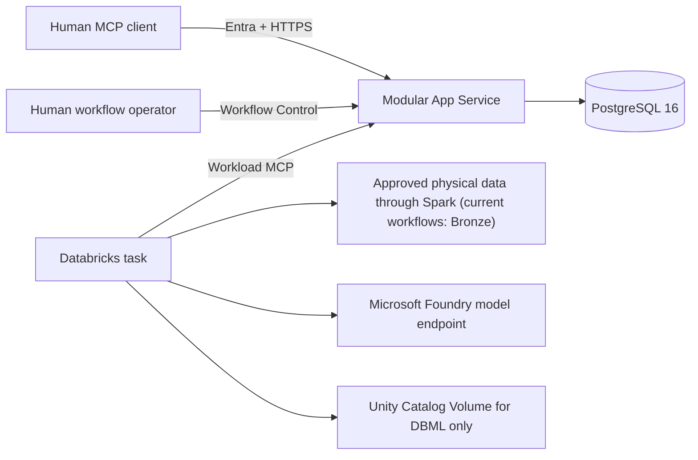

# System architecture

## System context



There are two deployable code shapes and one authoritative database:

- `gds_etl_workbench` is the App Service modular monolith.
- `gds_etl_jobs` is the source-loaded Databricks workflow library.
- PostgreSQL owns applied metadata and durable workflow state.

The Python packages do not import each other. Databricks crosses the boundary
through versioned MCP contracts and resources. It has no PostgreSQL driver.

## App Service responsibilities

The App Service owns:

- process configuration and mutation-promotion verification;
- HTTPS, request capacity, time limits, and Easy Auth identity parsing;
- actor-filtered MCP tools and resources;
- the three Workflow Control routes;
- current human and Workflow Grant authorization;
- catalog, Model, Evidence, readiness, snapshot, and DBML reads;
- Model Change Set compilation, validation, and apply;
- Profiling Run and Workflow Run state;
- PostgreSQL transactions, locks, idempotency, and receipts; and
- payload-free telemetry and readiness.

It is one process with one bounded PostgreSQL pool. Feature modules improve
locality; they are not services. There is no internal HTTP, command bus, event
bus, or microservice split.

## Databricks responsibilities

Each of the seven notebooks:

1. loads one fixed versioned source directory;
2. compiles its visible Notebook Definition once;
3. reads only `WorkflowRunID` and `WorkflowGrantID` widgets;
4. activates the run and verifies the frozen server contract;
5. obtains a verified snapshot or DBML archive;
6. executes one workflow within the grant deadline; and
7. returns redacted canonical JSON.

Jobs may read physical tables through fixed Spark adapters and call a configured
model endpoint through a bounded agent runtime. They may write files only in
the DBML workflow, beneath the deployment-owned Volume root. They never execute
Mapping-generated SQL or Python.

## Architectural layers

The App Service dependency direction is:

```text
HTTP/MCP adapters
    -> feature/application use cases
        -> domain policy and typed contracts
        -> abstract repository/system ports
            -> PostgreSQL and process-local adapters
```

Important boundaries:

- Domain code does not import HTTP, MCP, PostgreSQL, Azure, Databricks, Spark,
  or provider SDKs.
- MCP bindings translate already validated transport models. They do not own
  business authorization or relational integrity.
- Feature classes recheck mutable facts such as grants, locks, revisions,
  digests, and current identity.
- PostgreSQL enforces relationships, append-only records, lock protection,
  revision capture, and least privilege.
- Typed inputs are validated once at each trust seam. Stable rules are not
  duplicated in every layer.

## State ownership

| State | Authority | Lifetime |
|---|---|---|
| Applied Model graph and revision | PostgreSQL | Durable |
| Change Sets, grants, runs, profiling stages, receipts, audit events | PostgreSQL | Durable |
| Workflow Deployment definitions | Checked-in App Service asset | Process lifetime |
| Snapshot and DBML resource bytes | Bounded App Service cache | Reconstructible |
| Notebook Definition and workflow context | Databricks process | One run |
| Managed-identity tokens | In-memory token provider | Until refresh/expiry |
| DBML published files | Configured Unity Catalog Volume | Durable convenience output |
| Physical Bronze/Silver rows | External data platform | Outside metadata store |

## Main control paths

### Human interactive change

Human MCP read -> create Model Change Set -> replace whole Sections -> validate
future graph -> apply sealed candidate -> PostgreSQL receipt.

### Automated workflow

Human Workflow Control authorization -> manual/predefined Databricks launch ->
workload activation -> frozen contract -> workflow -> MCP finalization -> safe
human status.

### Read resource

Authorized request -> build deterministic snapshot or DBML bytes -> publish a
content-addressed process-local resource -> client downloads and verifies it.

Primary sources: [`docs/architecture/overview.md`](../architecture/overview.md),
[`mcp_server/src/gds_etl_workbench/runtime.py`](../../mcp_server/src/gds_etl_workbench/runtime.py),
and [`jobs/src/gds_etl_jobs/notebook.py`](../../jobs/src/gds_etl_jobs/notebook.py).
