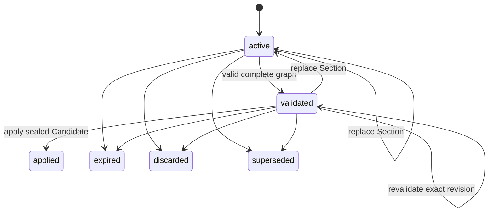

# Model Change Sets

A Model Change Set is the only general path for changing applied modeling
artifacts. It stores six complete operation documents and one global draft
revision.

## Draft shape

Every draft contains these Sections, even when untouched:

1. Evidence
2. Analysis
3. Conceptual
4. Logical
5. Dimensional
6. Mapping

Each Section is `{schema_version, section, operations}`. A put replaces the
complete Section; it is never a JSON patch. Create/update/lifecycle operations
use existing database IDs or typed local references. Omitted effective
artifacts remain unchanged.

## Lifecycle

Applied, expired, discarded, and superseded drafts are terminal and immutable.
The v1 registry has no public discard or supersede tool; the durable states do
not imply another MCP surface.

## Create

`create_model_change_set` receives the Model ID, expected Model revision,
idempotency key, and correlation ID.

The App Service:

1. resolves and authorizes the current human or grant-bound workload;
2. checks global idempotency and the exact expected Model revision;
3. copies the revision plus source, Evidence, and policy digests;
4. creates six empty Sections at draft revision `1`;
5. records a `created` event and expiry; and
6. binds the draft to the Workflow Grant when called by a workload.

All records commit together.

## Put a complete Section

`put_model_change_set_section` requires the current draft revision. The feature
canonicalizes and byte-bounds the complete document before locking. Under the
draft and optional grant locks it:

- checks actor, operation, binding, expiry, and idempotency;
- performs compare-and-swap on `expected_draft_revision`;
- replaces one complete Section;
- increments the global draft revision once;
- clears the prior validation result and candidate seal;
- returns status to `active`;
- refreshes expiry; and
- appends a Section event.

The caller must use the returned revision for the next put or validation.

## Validate the future graph

Validation never changes effective Model state.

1. Lock the draft and optional grant; fence the exact draft revision.
2. Compile the six draft Sections over the effective graph without a Mapping
   catalog. This discovers every physical Object needed for full validation.
3. Load those Objects, Attributes, lineage, Scope, and applicable Evidence.
4. Compile again with the authoritative catalog context.
5. Compare the current Model revision and context digests with the draft base.
6. Collect all safely discoverable issues, impact, and effective-change result.
7. If no error-severity issue exists, store the candidate digest and mark the
   same draft revision `validated`. Otherwise keep it `active` without a seal.

The compiler checks exact artifact families and Section ownership, references,
local-reference types, lifecycle closure, locks, source eligibility, DD-054
creation basis, policy, keys, grain, Mapping package rules, and dependency
graphs.

## Apply the sealed Candidate

Apply acquires locks in the fixed order Model -> Change Set -> optional Grant.
It reloads all mutable state, verifies idempotency, reauthorizes the actor,
requires the stored seal and validated draft revision, and recompiles the
Candidate under the locks. Any digest or context change aborts without an
effective write.

Materialization then:

1. allocates PostgreSQL IDs for all local creates;
2. resolves typed local and existing references;
3. strips transport-only operation fields and transient Conceptual basis data;
4. overlays create, update, and lifecycle operations on effective artifacts;
5. sorts the complete future Sections deterministically; and
6. records every local-reference-to-database-ID mapping.

One transaction writes the normalized effective graph, Model revision, terminal
draft, append-only event, idempotency result, Apply Receipt, local reference
mappings, and optional grant/summary completion. A real effective change
advances the revision by one. A valid no-change apply keeps it unchanged.

## Concurrency, expiry, and replay

- Create locks the optional grant, then its global idempotency outcome.
- Put and validate lock the draft, then the optional grant.
- Apply locks Model, draft, then optional grant.
- Same key and same request digest return the stored response with
  `replayed=true`.
- Same key and different digest return `idempotency_key_reused`.
- Successful create, put, and validation refresh the draft TTL; reads do not.
- A 30-second worker asks PostgreSQL to expire bounded batches using database
  time and `FOR UPDATE SKIP LOCKED`.
- PostgreSQL sequence increments may leave gaps after rollback; row changes do
  not partially commit.

Implementation:
[`change_sets/feature.py`](../../mcp_server/src/gds_etl_workbench/change_sets/feature.py),
[`application/compiler.py`](../../mcp_server/src/gds_etl_workbench/application/compiler.py),
and [`infrastructure/postgres.py`](../../mcp_server/src/gds_etl_workbench/infrastructure/postgres.py).
