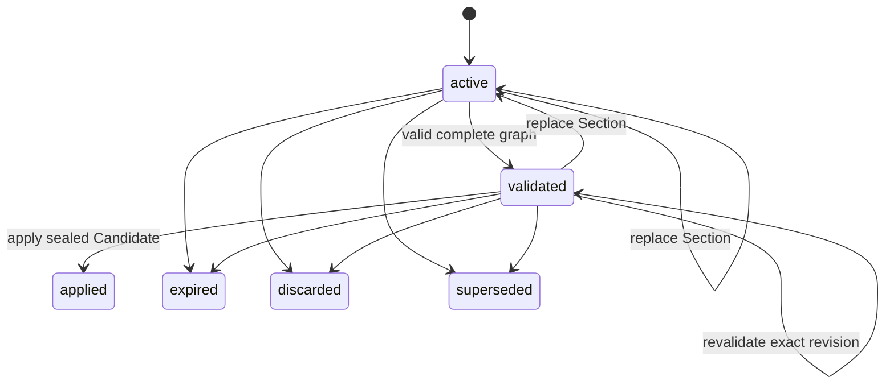

# Model Change Sets

A Model Change Set is the only general path for changing applied modeling
artifacts. It stores eight complete operation documents and one global draft
revision.

## Draft shape

Every draft contains these Sections, even when untouched:

1. Model Scope
2. Profiling
3. Assertion
4. Analysis
5. Conceptual
6. Logical
7. Dimensional
8. Mapping

Each Section is `{schema_version, section, operations}`. A put replaces the
complete Section; it is never a JSON patch. Create/update/lifecycle operations
use existing database IDs or typed local references. Omitted effective
artifacts remain unchanged.

## Lifecycle

Applied, expired, discarded, and superseded drafts are terminal and immutable.
`archive_model_change_set` moves a caller-owned active/validated draft to the
retained `discarded` state without deleting it. There is no public supersede tool.

## Create

`create_model_change_set` receives the Model ID, expected Model revision,
idempotency key, and correlation ID.

The App Service:

1. resolves and authorizes the current human or grant-bound workload;
2. checks global idempotency and the exact expected Model revision;
3. copies the revision plus source, Assertion, and policy digests;
4. creates eight empty documents at draft revision `1`;
5. records a `created` event and expiry; and
6. binds the draft to the Workflow Grant when called by a workload.

All records commit together.

The three base digests are independent stale-input fences:

- source-context digest covers the selected physical catalog and Model Scope;
- Assertion digest covers the Assertions used by the draft; and
- policy digest covers naming, audit, and technical Model policies.

Validate and apply compare them with the current values. A mismatch rejects a
stale draft instead of applying work produced from outdated context.

## Put a complete Section

`put_model_change_set_section` requires the current draft revision. The feature
canonicalizes and byte-bounds the complete document before locking. Under the
draft and optional grant locks it:

- checks actor, operation, binding, expiry, and idempotency;
- performs compare-and-swap on `expected_draft_revision`;
- replaces one complete Section;
- increments the global draft revision once;
- clears the prior validation result and candidate seal;
- returns status to `active`;
- refreshes expiry; and
- appends a Section event.

The caller must use the returned revision for the next put or validation.

## Validate the future graph

Validation never changes effective Model state.

1. Lock the draft and optional grant; fence the exact draft revision.
2. Compile the eight draft documents over the effective graph without a Mapping
   catalog. This discovers every physical Object needed for full validation.
3. Load those Objects, Attributes, lineage, Scope, and applicable Assertions.
4. Compile again with the authoritative catalog context.
5. Compare the current Model revision and context digests with the draft base.
6. Collect all safely discoverable issues, impact, and effective-change result.
7. If no error-severity issue exists, store the candidate digest and mark the
   same draft revision `validated`. Otherwise keep it `active` without a seal.

The compiler checks exact artifact families and Section ownership, references,
local-reference types, lifecycle closure, locks, source eligibility, DD-054
creation basis, policy, keys, grain, Mapping package rules, and dependency
graphs.

## Apply the sealed Candidate

Apply acquires locks in the fixed order Model -> Change Set -> optional Grant.
It reloads all mutable state, verifies idempotency, reauthorizes the actor,
requires the stored seal and validated draft revision, and recompiles the
Candidate under the locks. Any digest or context change aborts without an
effective write.

Materialization then:

1. allocates PostgreSQL IDs for all local creates;
2. resolves typed local and existing references;
3. strips transport-only operation fields;
4. overlays create, update, and lifecycle operations on effective artifacts;
5. sorts the complete future Sections deterministically; and
6. records every local-reference-to-database-ID mapping.

One transaction writes the normalized effective graph, Model revision, terminal
draft, append-only event, idempotency result, Apply Receipt, local reference
mappings, and optional grant/summary completion. A real effective change
advances the revision by one. A valid no-change apply keeps it unchanged.

## Tenant Metadata Change Sets

`mcp.metadata_change_set` uses the same draft lifecycle for Tenant-owned
Core metadata. Its sixteen list-shaped documents are Source/Bronze/Silver/Gold
Object and Attribute pairs, both Ingestion Mappings, Copy Group, Member Group,
Copy Group Control, Copy, Process Group, and Process. Current Tenant Lock
ownership protects creation, staging, validation, and apply. Events are
append-only; archived drafts remain stored as terminal history.

The installed metadata workflow is:

1. check/acquire the Tenant Lock;
2. create a fresh Metadata Snapshot and inspect only needed files;
3. create or resume the Principal's one ongoing Change Set;
4. stage one complete ID-free dataset list at a time using `draft_revision`;
5. get counts or one selected dataset without loading all documents into chat;
6. validate shared Pydantic schemas, Tenant scope, natural-key uniqueness, and
   references; then fix the first failed phase; and
7. apply, which repeats validation and natural-key resolution in the same
   PostgreSQL transaction.

`archive_metadata_change_set` retains an abandoned active/validated draft.
Get and archive enforce Tenant access plus creator ownership but do not require
a current Tenant Lock. An empty staged list clears that pending dataset; it does
not delete applied metadata. Apply performs upserts only. Lifecycle changes use
full records with `is_active=false`. Object changes are limited to connections
owned by the locked Tenant or active global discovery scopes owned by it.

## Concurrency, expiry, and replay

- Create locks the optional grant, then its global idempotency outcome.
- Put and validate lock the draft, then the optional grant.
- Apply locks Model, draft, then optional grant.
- Same key and same request digest return the stored response with
  `replayed=true`.
- Same key and different digest return `idempotency_key_reused`.
- Creating, complete-section staging, and validation establish or refresh the
  draft TTL; reads do not extend it. Chunk puts only refresh batch activity
  within the parent draft expiry.
- Governed Model Change Set calls enforce expiry lazily with PostgreSQL-owned
  wall-clock time after row locking. Expiring a draft also expires its active
  Stage Batches and appends one retained expiry event.
- PostgreSQL sequence increments may leave gaps after rollback; row changes do
  not partially commit.

Current implementation:
[`tools/change_sets/model.py`](../../mcp_server/gds_etl_workbench/tools/change_sets/model.py),
[`tools/change_sets/model_validation.py`](../../mcp_server/gds_etl_workbench/tools/change_sets/model_validation.py),
and [`tools/change_sets/model_apply.py`](../../mcp_server/gds_etl_workbench/tools/change_sets/model_apply.py).
