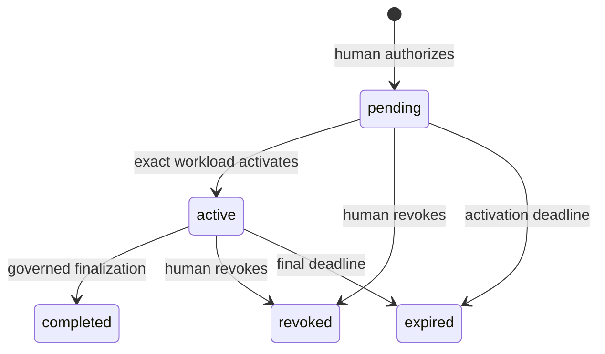

# Workflow Control and notebook runtime

## Why Workflow Control is separate from MCP

Humans may decide that an automated workflow should run, but they must not
discover or invoke workload execution, Profiling staging, or Mapping
materialization tools through MCP. The product therefore exposes exactly three
human JSON routes outside MCP: authorize, revoke, and status.

The App Service remains one monolith. These routes call the same feature,
authorization, repository, telemetry, and error policies as MCP.

## Authorization sequence

1. A human posts a complete workflow-specific request and checked-in `job_key`
   to the authorize route.
2. The server locks the Model and global idempotency key.
3. It resolves the current human, owning Tenant, and role; requires an active
   Model and workflow-authorization capability.
4. Readiness evaluates the exact request.
5. The deployment registry supplies the workflow, operation allowlist, source
   release, and Notebook Definition version.
6. The server freezes the full request and a digest of its selection.
7. It stores a pending Workflow Grant and pending Workflow Run Summary.
8. The launch response returns safe handles and deployment identity, not a
   credential or full request.

The pending grant has a maximum 15-minute activation window and a maximum
four-hour final expiry.

## Grant lifecycle

The safe summary normally moves `pending -> running -> completed` or to a
terminal warning/failure/revoked/expired state. Analysis discovery-only may
move `running -> awaiting_validation` and later resume.

The complete Workflow Run Summary transitions are:

- `pending -> running|expired|revoked`;
- `running -> awaiting_validation|completed|completed_with_warnings|blocked|failed|expired|revoked`;
- `awaiting_validation -> running|completed|completed_with_warnings|blocked|failed|expired|revoked`; and
- `blocked -> blocked|running|failed|expired|revoked`.

`blocked` is intentionally nonterminal. A completed grant is normally closed;
only the exact Mapping materialization or DBML completion continuation allowed
by its original contract may still read committed output or finish its receipt.

## Activation and contract loading

The predefined Databricks task receives only `WorkflowRunID` and
`WorkflowGrantID`. The notebook supplies its compiled workflow name, job key,
source release, Notebook Definition version, and Databricks run evidence to
`activate_workflow_run`.

The server locks and rechecks the Model and grant, exact workload identity,
initiating human, release identity, activation window, and idempotency. A new
activation changes the grant to `active` and summary to `running` in one
transaction.

The notebook then calls `get_workflow_run_contract`. It verifies the exact
handles, workflow, Model, job key, release, definition version, allowed
operations, binding, state, and expiry before it constructs a typed business
request. Widgets never carry the business request or identity.

## Notebook Definition

Each notebook owns and exposes:

- one workflow name, source release, and definition version;
- the exact ordered phase set;
- one selected agent runtime for agent-backed workflows;
- model deployment, reasoning, verbosity, turns, outer retries, tools,
  prompts, and prompt parameters per phase; and
- workflow concurrency, Section-byte limit, and repair rounds.

The definition is compiled once with strict Pydantic and Jinja validation.
Unknown tools, phases, prompt variables, runtimes, or over-limit settings fail
before activation or provider work.

Profiling and DBML are deterministic and declare no agent runtime. Analysis,
Conceptual, Logical, Dimensional, and Mapping select exactly one of:

- `openai_agents_sdk`
- `langchain_create_agent`
- `langchain_deep_agent`

The checked-in notebooks select `openai_agents_sdk`. All three implementations
share one code-owned deadline, cancellation, concurrency, retry, model-call,
token, tool, typed-output, redaction, and telemetry envelope. Provider-native
retries, reconnects, tracing, caches, ambient proxies, and sensitive logging
are disabled. Deep Agents has no filesystem, execution, persistence, memory,
skills, or subagent surface and uses a 64 KiB context cap.

## Common runtime sequence

1. Read and validate both UUID handles.
2. Lazily construct managed-identity, MCP, Spark, agent, and DBML adapters.
3. Activate and load the immutable contract.
4. Build exactly one workflow runner.
5. Use the grant expiry as the absolute execution deadline.
6. For six workflows, request and verify a Model Snapshot, then project a
   typed workflow context. DBML verifies its separate export archive.
7. For the six snapshot-backed workflows, track one terminal coverage outcome
   for every required work item. DBML verifies exact manifest/member/file
   coverage instead.
8. Recheck context identity before non-empty persistence.
9. Complete by Profiling finalization, Model Change Set apply, exact no-op, or
   DBML receipt.
10. Redact and return canonical JSON; flush payload-free telemetry.

## Completion paths

| Result | Server action | Model revision |
|---|---|---|
| Empty modeling Section | `complete_workflow_no_op` with exact context fence | Unchanged |
| Analysis discovery-only with pending work | Stage the bound Analysis Change Set and enter `awaiting_validation` | Unchanged |
| Non-empty final Analysis/Conceptual/Logical/Dimensional/Mapping | Validate and apply bound Change Set | +1 only for effective change |
| Profiling | Validate and finalize staged success/failure coverage | +1 only if a stored profile changes |
| DBML | Rebuild identity and record publication receipt | Unchanged |

## Status, revocation, and expiry

The status route returns only identifiers, grant/run state, aggregate counts,
times, binding flags, and a diagnostic count. It never returns the frozen
request, prompts, candidate, raw diagnostics, or receipts.

The initiating human or owning-Tenant security admin may revoke pending or
active work with a bounded reason. Grant, summary, and idempotency result commit
together. A background worker uses PostgreSQL time and row locks to expire
pending or active grants in bounded batches. Grants are never renewed or
broadened; a human must authorize a fresh run.

Implementation:
[`workflow_runs/feature.py`](../../mcp_server/src/gds_etl_workbench/workflow_runs/feature.py),
[`adapters/workflow_control/routes.py`](../../mcp_server/src/gds_etl_workbench/adapters/workflow_control/routes.py),
and [`jobs/src/gds_etl_jobs/runtime/launch.py`](../../jobs/src/gds_etl_jobs/runtime/launch.py).
