# GDS Workbench solution overview

Two access paths and one shared PostgreSQL source of truth.

```mermaid
flowchart LR
    subgraph developerAccess["DEVELOPER ACCESS"]
        direction TB
        developer(["Developer"])
        vscode["VS Code<br/>GDS Plugin"]
        localHtml["Local HTML<br/>Workbench"]
        developer --> vscode
        vscode --- localHtml
    end

    mcpIdentity["Microsoft Entra ID<br/>Authentication"]

    subgraph azureMcp["AZURE MCP PLATFORM"]
        direction TB

        subgraph appService["Azure App Service"]
            direction TB
            easyAuth["Easy Auth"]
            mcp["MCP Server"]
            easyAuth --> mcp
        end

        keyVault["Key Vault"]
        storage["Storage Account<br/>Snapshots"]
        mcp -.-> keyVault
        mcp -.-> storage
    end

    postgres[("PostgreSQL<br/>SOURCE OF TRUTH<br/>Data · Authorization · Locks · Audit")]

    subgraph workflowPlatform["WORKFLOW PLATFORM"]
        direction TB
        workflows["GDS Workflows<br/>Shared Logic"]

        subgraph workflowAreas["Workflow areas"]
            direction LR
            profiling["Profiling"]
            analysis["Analysis"]
            conceptual["Conceptual"]
            logical["Logical"]
            dimensional["Dimensional"]
        end

        models["Foundry + Databricks<br/>Models and Data"]

        workflows --> profiling & analysis & conceptual & logical & dimensional
        profiling & analysis & conceptual & logical & dimensional --> models
    end

    subgraph databricksApp["DATABRICKS WEB APP"]
        direction LR
        fastapi["FastAPI"]
        react["React Front End"]
        fastapi <-->|"API"| react
    end

    webIdentity["Databricks OAuth<br/>Entra User Identity"]

    subgraph userAccess["WEB & NOTEBOOK ACCESS"]
        direction TB
        browser["Web Browser"]
        notebooks["Databricks Notebooks"]
    end

    vscode --> mcpIdentity
    mcpIdentity --> easyAuth
    mcp <-->|"Governed access"| postgres

    postgres <-->|"Governed state"| workflows
    workflows <-->|"API"| fastapi
    workflows <-->|"Run"| notebooks
    react <-->|"HTTPS"| webIdentity
    webIdentity <-->|"Sign in"| browser

    classDef access fill:#EFF6FF,stroke:#2563EB,color:#0F172A,stroke-width:1px;
    classDef auth fill:#FFF7ED,stroke:#D97706,color:#0F172A,stroke-width:1px;
    classDef app fill:#EEF2FF,stroke:#4F46E5,color:#0F172A,stroke-width:1px;
    classDef source fill:#ECFDF5,stroke:#059669,color:#052E16,stroke-width:3px;
    classDef service fill:#F8FAFC,stroke:#64748B,color:#0F172A,stroke-width:1px;

    class developer,vscode,localHtml,browser,notebooks access;
    class mcpIdentity,webIdentity,easyAuth auth;
    class mcp,workflows,profiling,analysis,conceptual,logical,dimensional,fastapi,react app;
    class postgres source;
    class keyVault,storage,models service;

    style developerAccess fill:#F8FAFC,stroke:#93C5FD,stroke-width:1px;
    style userAccess fill:#F8FAFC,stroke:#93C5FD,stroke-width:1px;
    style azureMcp fill:#FFFFFF,stroke:#C7D2FE,stroke-width:1px;
    style appService fill:#F8FAFC,stroke:#CBD5E1,stroke-width:1px;
    style workflowPlatform fill:#FFFFFF,stroke:#C7D2FE,stroke-width:1px;
    style workflowAreas fill:#F8FAFC,stroke:#CBD5E1,stroke-width:1px;
    style databricksApp fill:#FFFFFF,stroke:#C7D2FE,stroke-width:1px;
```

## Reading the diagram

- The left path is VS Code → Entra ID → Azure App Service → MCP → PostgreSQL.
- The right path is Browser → Databricks Web App → shared workflows →
  PostgreSQL.
- Notebooks run the same workflow logic directly.
- PostgreSQL authorizes access. Entra ID and Databricks OAuth authenticate
  users.

The workflow box is a logical view. Its code is packaged separately with the
Web App and notebooks; it is not another deployed service.

Profiling uses governed Databricks data reads. The agent workflows use the
selected Foundry or Databricks model.

## References

- [Architecture overview](overview.md)
- [Security](../security.md)
- [MCP deployment](../AZURE_FRESH_DEPLOYMENT.md)
- [Web App deployment](../../web_app/DEPLOYMENT_GUIDE.md)
- [Notebook deployment](../../databricks_notebooks/README.md)
