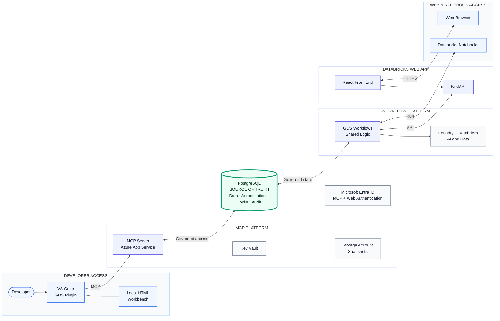

# GDS Workbench solution overview

Separate entry points. One governed PostgreSQL source of truth.

## Reading the diagram

- **Left:** developer access flows from VS Code to MCP.
- **Center:** PostgreSQL owns shared data and authorization.
- **Right:** the Web App and notebooks use the same GDS workflow logic.
- **Supporting services:** Entra ID, Key Vault, Storage, Foundry, and
  Databricks.

The workflow box is a logical view. Its code is packaged independently with the
Databricks Web App and notebooks; it is not a separate deployed service.

## References

- [Architecture overview](overview.md)
- [Security](../security.md)
- [MCP deployment](../AZURE_FRESH_DEPLOYMENT.md)
- [Web App deployment](../../web_app/DEPLOYMENT_GUIDE.md)
- [Notebook deployment](../../databricks_notebooks/README.md)
